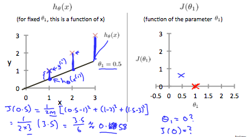

# Introduction

## What is Machine Learning?

Two definitions of Machine Learning are offered.

- Arthur Samuel described it as: "the field of study that gives computers the ability to learn without being explicitly programmed." This is an older, informal definition.
- Tom Mitchell provides a more modern definition: "A computer program is said to learn from experience E with respect to some class of tasks T and performance measure P, if its performance at tasks in T, as measured by P, improves with experience E."

---

Example: playing checkers.

- E = the experience of playing many games of checkers

- T = the task of playing checkers.

- P = the probability that the program will win the next game.

---

In general, any machine learning problem can be assigned to one of two broad classifications:

- Supervised learning
- Unsupervised learning.

## Supervised Learning

In supervised learning, we are given a data set and already know what our correct output should look like, having the idea that there is a relationship between the input and the output.

Supervised learning problems are categorized into "**regression**" and "**classification**" problems. 

- In a **regression** problem, we are trying to predict results within a <u>continuous output</u>, meaning that we are trying to map input variables to some continuous function. 
- In a **classification** problem, we are instead trying to predict results in a <u>discrete output</u>. In other words, we are trying to map input variables into discrete categories.

---

**Example 1:**

Given data about the size of houses on the real estate market, try to predict their price. Price as a function of size is a continuous output, so this is a regression problem.

We could turn this example into a classification problem by instead making our output about whether the house "sells for more or less than the asking price." Here we are classifying the houses based on price into two discrete categories.

**Example 2**:

(a) Regression - Given a picture of a person, we have to predict their age on the basis of the given picture

(b) Classification - Given a patient with a tumor, we have to predict whether the tumor is malignant or benign.

---

## Unsupervised Learning

Unsupervised learning allows us to approach problems with little or no idea what our results should look like. We can derive structure from data where we don't necessarily know the effect of the variables.

We can derive this structure by **clustering** the data based on relationships among the variables in the data.

With unsupervised learning there is **no feedback based on the prediction results.**

application:

- organize computing clusters
- social network analysis
- market segmentation
- astronomical data analysis

---

**Example:**

**Clustering**: Take a collection of 1,000,000 different genes, and find a way to automatically group these genes into groups that are somehow similar or related by different variables, such as lifespan, location, roles, and so on.

**Non-clustering**: The "Cocktail Party Algorithm", allows you to find structure in a chaotic environment. (i.e. identifying individual voices and music from a mesh of sounds at a [cocktail party](https://en.wikipedia.org/wiki/Cocktail_party_effect)).

---

# Linear Regression with One Variable

## Model and Cost Function

### Model Representation

- $x^{(i)}$: input or input feature
- $y^{(i)}$: output or target variable
- $(x^{(i)},y^{(i)})$: training example
- $\{(x^{(1)},y^{(1)}), \cdots,(x^{(m)}, y^{m})\}$: training set
- $X$: space of input values
- $Y$: space of output values

To describe the supervised learning problem slightly more formally, our goal is, **given a training set, to learn a function $h : X → Y$ so that $h(x)$ is a “good” predictor for the corresponding value of $y$.** For historical reasons, this function $h$ is called a **hypothesis**. Seen pictorially, the process is therefore like this:

two kind of problem:

- regression problem: the target variable that we're trying to predict is continuous
- classification problem:  $y$ can take on only a small number of discrete values 

### Cost Function

We can **measure the accuracy** of our hypothesis function by using a **cost function**. One of the cost function is "**Squared error function**", or "**Mean squared error**". 

$$
J(\theta_0, \theta_1) = \frac{1}{2m} \sum_{i=1}^{m} (\hat{y}_i − y_i)^2 = \frac{1}{2m} \sum_{i=1}^m (h_θ(x_i)−y_i)^2
$$

> $\frac{1}{2}$ is a convenience for the computation of the gradient descent

The following image summarizes what the cost function does:

#### Cost Function - Intuition I

If we try to think of it in visual terms, our training data set is scattered on the $x-y$ plane. We are trying to make a straight line (defined by $h_θ(x)$) which passes through these scattered data points.

Our objective is to get the best possible line. The best possible line will be such so that **the average squared vertical distances of the scattered points from the line will be the least.** Ideally, the line should pass through all the points of our training data set. In such a case, the value of $J(θ_0,θ_1)$ will be 0. The following example shows the ideal situation where we have a cost function of 0.

When $θ_1=1$, we get a slope of 1 which goes through every single data point in our model. Conversely, when $θ_1=0.5$, we see the vertical distance from our fit to the data points increase.

This increases our cost function to 0.58. Plotting several other points yields to the following graph:

Thus as a goal, we should try to minimize the cost function. In this case, $θ_1=1$ is our global minimum. 

#### Cost Function - Intuition II

A contour plot is a graph that contains many contour lines. A contour line of a two variable function has a constant value at all points of the same line. An example of such a graph is the one to the right below.

Taking any color and going along the 'circle', one would expect to get the same value of the cost function. For example, the three green points found on the green line above have the same value for $J(θ_0,θ_1)$ and as a result, they are found along the same line. The circled x displays the value of the cost function for the graph on the left when θ0 = 800 and $θ_1= -0.15$. Taking another $h(x)$ and plotting its contour plot, one gets the following graphs:

When $θ_0 = 360$ and $θ_1 = 0$, the value of $J(θ_0,θ_1)$ in the contour plot gets closer to the center thus reducing the cost function error. Now giving our hypothesis function a slightly positive slope results in a better fit of the data.

The graph above minimizes the cost function as much as possible and consequently, the result of $θ_1$ and $θ_0$ tend to be around 0.12 and 250 respectively. Plotting those values on our graph to the right seems to put our point in the center of the inner most 'circle'.

## Parameter Learning

### Gradient Descent

So we have our hypothesis function and we have a way of measuring how well it fits into the data. Now we need to estimate the parameters in the hypothesis function. That's where gradient descent comes in.

We can graph our cost function as a function of the parameter estimates. 

What we want is that the cost function reach its minimum value. The red arrows show the minimum points in the graph.

The way we do this is by taking the derivative (the tangential line to a function) of our cost function. The slope of the tangent is the derivative at that point and it will give us a direction to move towards. We make steps down the cost function in the direction with the **steepest descent**. The size of each step is determined by the parameter $\alpha$, which is called the **learning rate.** 

- The direction is determined by partial derivative of $J(θ_0,θ_1)$
- A smaller $\alpha$ would result in a smaller step and a larger $\alpha$ results in a larger step.
- Depending on where one starts on the graph, one could end up at different points.

The gradient descent algorithm is:

> repeat until convergence:
> $$
> \theta_j:=\theta_j−\alpha \frac{\partial}{\partial \theta_j} J(\theta_0,\theta_1)
> $$
> where
>
> $j=0,1$ represents the feature index number.
>

At each iteration , one should **simultaneously** update the parameters $θ_1,θ_2,...,θ_n$. 

### Gradient Descent For Linear Regression

In the case of linear regression, we can substitute our actual cost function and our actual hypothesis function and modify the equation to :

> repeat until convergence: {
> $$
> \theta_0 := \theta_0 - \alpha \frac{1}{m} \sum_{i=1}^{m} (h_\theta^{(x_i)} - y_i) \\
> \theta_1 := \theta_1- \alpha \frac{1}{m} \sum_{i=1}^{m} ((h_\theta^{(x_i)} - y_i)x_i)
> $$
> }
>

- $m$: size of the training set
- $\theta_0, \theta_1$: weight
- $(x_i, y_i)$: training data

> calculating the derivative
>
> 

The point of all this is that if we start with a guess for our hypothesis and then repeatedly apply these gradient descent equations, our hypothesis will become more and more accurate.

So, this is simply gradient descent on the original cost function $J$. This method looks at every example in the entire training set on every step, and is called **batch gradient descent**. 

Note that gradient descent has a chance to stuck in local minima. However linear regression has only one global, so if the learning rate $\alpha$ is not too large, gradient descent will always converges to global minimum. Indeed, $J$ is a convex quadratic function. Here is an example of gradient descent as it is run to minimize a quadratic function.

