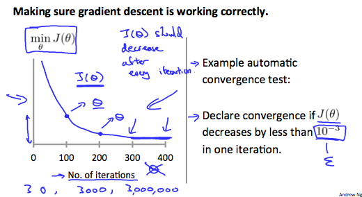

# Linear Regression with Multiple Variables

## Multivariate Linear Regression

### Multiple Features

Linear regression with multiple variables is also known as "**multivariate linear regression**".

notation:
$$
\begin{align*}x_j^{(i)} &= \text{value of feature } j \text{ in the }i^{th}\text{ training example} \newline x^{(i)}& = \text{the input (features) of the }i^{th}\text{ training example} \newline m &= \text{the number of training examples} \newline n &= \text{the number of features} \end{align*}
$$

hypothesis and **vectorization**
$$
h_\theta (x) = \theta_0 + \theta_1 x_1 + \theta_2 x_2 + \theta_3 x_3 + \cdots + \theta_n x_n
$$
$$
\begin{align}
h_\theta(x) & =\theta_0 + \theta_1 x_1 + \theta_2 x_2 + \theta_3 x_3 + \cdots + \theta_n x_n \\
& = \begin{bmatrix}\theta_0 &\theta_1 & \cdots & \theta_n\end{bmatrix}\begin{bmatrix}x_0 \newline x_1 \newline \vdots \newline x_n\end{bmatrix} \\
&= \theta^T x
\end{align}
$$
Remark: Note that for convenience reasons in this course we assume $x^{(i)}_0=1$ for $(i∈1,…,m)$. This allows us to do matrix operations with $\theta$ and $x$. Hence making the two vectors '$θ$' and $x^{(i)}$ match each other element-wise (that is, have the same number of elements: $n+1$).]

### **Gradient Descent for Multiple Variables**

The gradient descent equation itself is generally the same form; we just have to repeat it for our $n$ features:
| Gradient Descent for Multiple Variables |
| :--: |
| $$\begin{align*}& \text{repeat until convergence:} \; \lbrace \newline \; & \theta_j := \theta_j - \alpha \frac{1}{m} \sum\limits_{i=1}^{m} (h_\theta(x^{(i)}) - y^{(i)}) \cdot x_j^{(i)} \; & \text{for j := 0...n}\newline \rbrace\end{align*}$$ |

The following image compares gradient descent with one variable to gradient descent with multiple variables:

### Gradient Descent in Practice I - Feature Scaling

**We can speed up gradient descent by having each of our input values in roughly the same range.** This is because $\theta$ will descend quickly on small ranges and slowly on large ranges, and so will oscillate inefficiently down to the optimum when the variables are very uneven.

The way to prevent this is to modify the ranges of our input variables so that they are all roughly the same. Ideally $−1 ≤ x_{(i)} ≤ 1 $ or $−0.5 ≤ x_{(i)} ≤ 0.5$

These aren't exact requirements; we are only trying to speed things up. **The goal is to get all input variables into roughly one of these ranges, give or take a few.**

Two techniques to help with this are **feature scaling** and **mean normalization**. 

- **Feature scaling**: <u>dividing the input values by the range</u> of the input variable, resulting $−1 ≤ x_i ≤ 1 $. 

- **Mean normalization**: <u>subtracting the average value</u> for an input variable from the values for that input variable resulting $E(x_i)=0$ 

- To implement both:
  $$
  x_i := \dfrac{x_i - \mu_i}{s_i}
  $$
  Where $μ_i$ is the **average** of all the values for feature $(i)$ and $s_i$ is the **range** of values (max - min), or $s_i$ is the **standard deviation**.

### Gradient Descent in Practice II - Learning Rate

#### Debugging gradient descent

Make a plot with *number of iterations* on the x-axis. Now plot the cost function, $J(θ)$ over the number of iterations of gradient descent. If $J(θ)$ ever increases, then you probably need to decrease $\alpha$

#### Automatic convergence test

Declare convergence if $J(θ)$ decreases by less than $\varepsilon$ in one iteration, where $\varepsilon$ is some small value such as $10^{−3}$. However in practice it's difficult to choose this threshold value.

It has been proven that if learning rate $\alpha$ is sufficiently small, then $J(θ)$ will decrease on every iteration.

To summarize:

- If $\alpha$ is too small: slow convergence.
- If $\alpha$ is too large: may not decrease on every iteration and thus may not converge.

### Features and Polynomial Regression

We can improve our features and the form of our hypothesis function in a couple different ways.

**We can combine multiple features into one.** For example, we can combine $x_1$ and $x_2$ into a new feature $x_3$ by taking $x_1\cdot x_2$.

#### Polynomial Regression

Our hypothesis function need not be linear (a straight line) if that does not fit the data well.

We can **change the behavior or curve** of our hypothesis function by making it a quadratic, cubic or square root function (or any other form).

For example, if our hypothesis function is $h_\theta(x)=\theta_0+\theta_1 x_1$ then we can create additional features based on $x_1$, to get the quadratic function $h_\theta(x)=\theta_0+\theta_1x_1+\theta_2x^2_1$ or the cubic function $h_\theta(x)=\theta_0+\theta_1x_1+\theta_2x^2_1+\theta_3x^3_1$

In the cubic version, we have created new features $x_2$ and $x_3$ where $x_2=x^2_1$ and $x_3=x^3_1$.

To make it a square root function, we could do: $h_\theta(x)=\theta_0+\theta_1x_1+\theta_2 \sqrt {x_1} $

One important thing to keep in mind is, if you choose your features this way then feature scaling becomes very important.

> e.g. if $x_1$ has range 1 - 1000 then range of $x^2_1$ becomes 1 - 1000000 and that of $x^3_1$ becomes 1 - 1000000000

## Computing Parameters Analytically

### Normal Equation

A second way to minimize $J(\theta)$ is **Normal Equation** method. We will minimize $J(\theta)$ by explicitly taking its derivatives with respect to the $\theta_j$'s, and setting them to zero. This allows us to find the optimum $\theta$ without iteration. 
$$
\theta=(X^TX)^{-1}X^Ty
$$
> Example:
>
> 

There is no need to do feature scaling with the normal equation.

#### Comparison between Gradient Descent and Normal Equation

| Gradient Descent             | Normal Equation                               |
| ---------------------------- | --------------------------------------------- |
| Need to choose $\alpha$      | No need to choose alpha                       |
| Needs many iterations        | No need to iterate                            |
| $O(kn^2)$                    | $O(n^3)$, need to calculate inverse of $X^TX$ |
| Works well when $n$ is large | Slow if $n$ is very large                     |

In practice, when $n$ exceeds **10,000** it might be a good time to go from a normal solution to an iterative process.

### Normal Equation Noninvertibility

When implementing the normal equation in octave we want to use the `pinv` function rather than `inv`. The `pinv` function will give you a value of $\theta$ even if $X^TX$ is not invertible.

If $X^TX$ is **noninvertible,** the common causes might be having :

- **Redundant features**, where two features are very closely related (i.e. they are linearly dependent)
- **Too many features** (e.g. m ≤ n). In this case, delete some features or use "regularization" (to be explained in a later lesson).

Solutions to the above problems include deleting a feature that is linearly dependent with another or deleting one or more features when there are too many features.
