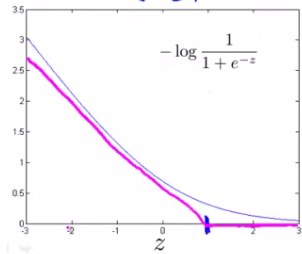

# Support Vector Machine

## Large Margin Classification

### Optimization Objective

The **Support Vector Machine** (SVM) is yet another type of **supervised** machine learning algorithm. It is sometimes cleaner and more powerful.

Recall that in logistic regression, we use the following rules:

- if $y=1$, then $h_{\theta}(x) \approx 1$ and $\Theta^Tx \gg 0$

- if $y=0$, then $h_{\theta}(x) \approx 0$ and $\Theta^Tx \ll 0$

Recall the cost function for (unregularized) logistic regression:

$$
\begin{align*}
J(\theta) & = \frac{1}{m}\sum_{i=1}^m -y^{(i)} \log(h_\theta(x^{(i)})) - (1 - y^{(i)})\log(1 - h_\theta(x^{(i)}))\newline
& = \frac{1}{m}\sum_{i=1}^m -y^{(i)} \log\Big(\dfrac{1}{1 + e^{-\theta^Tx^{(i)}}}\Big) - (1 - y^{(i)})\log\Big(1 - \dfrac{1}{1 + e^{-\theta^Tx^{(i)}}}\Big)
\end{align*}
$$

To make a support vector machine, we will modify the loss function to  [hinge loss  function](https://en.wikipedia.org/wiki/Hinge_loss) 

- $\text{cost}_1(z)$ is the cost for classifying when $y=1$

  

- $\text{cost}_0(z)$ is the cost for classifying when $y=0$

  

we formally define them as follows (where $k$ is an arbitrary constant defining the magnitude of the slope of the line):

$$
z = \theta^Tx\\
\text{cost}_0(z) = \max(0, k(1+z)) \\
\text{cost}_1(z) = \max(0, k(1-z))
$$

The full cost function from (regularized) logistic regression is

$$
J(\theta) = \frac{1}{m} \sum_{i=1}^m y^{(i)}(-\log(h_\theta(x^{(i)}))) + (1 - y^{(i)})(-\log(1 - h_\theta(x^{(i)}))) + \dfrac{\lambda}{2m}\sum_{j=1}^n \Theta^2_j
$$

Now we transform this into the cost function for support vector machines:

$$
J(\theta) = C\sum_{i=1}^m y^{(i)}{\text{cost}_1}(\theta^T x^{(i)}) + (1 - y^{(i)}) {\text{cost}_0}(\theta^T x^{(i)}) + \dfrac{1}{2}\sum_{j=1}^n \Theta_j^2
$$

modifications:

1. substituting $\text{cost}_0(z)$ and $\text{cost}_1(z)$
2. multiplying by $m$
3. multiplying the equation by $C=\dfrac{1}{λ}$

Convention dictates that we regularize using a factor $C$ instead of $\lambda$. 

- regularize more (that is, reduce overfitting), we **decrease** C
- regularize less (that is, reduce underfitting), we **increase** C.

Finally, note that the hypothesis of the Support Vector Machine is **not** interpreted as the probability of $y$ being 1 or 0 (as it is for the hypothesis of logistic regression). Instead, it outputs either 1 or 0. (In technical terms, it is a discriminant function.)
$$
h_\theta(x) =\begin{cases}    1 & \text{if} \ \Theta^Tx \geq 0 \\    0 & \text{otherwise}\end{cases}
$$

### Large Margin Intuition

A useful way to think about Support Vector Machines is to think of them as **Large Margin Classifiers**.

- If $y=1$, we want $\Theta^Tx \geq 1$ (not just $\geq 0$)

- If $y=0$, we want $\Theta^Tx \leq −1$ (not just $\lt 0$)

Now when we set our constant $C$ to a very **large** value (e.g. 100,000), our optimizing function will constrain $\Theta$ such that the equation $A$ (the summation of the cost of each example) equals 0. We impose the following constraints on $\Theta$:

$$
\begin{cases}
\Theta^T x \geq 1, & y = 1 \\
\Theta^T x \leq -1, & y = 0 
\end{cases}
$$

If $C$ is very large, we must choose $\Theta$ parameters such that:

$$
\sum_{i=1}^m y^{(i)}\text{cost}_1(\Theta^Tx^{(i)}) + (1 - y^{(i)})\text{cost}_0(\Theta^Tx^{(i)}) = 0
$$

This reduces our cost function to:

$$
\begin{align*}
J(\theta) = C \cdot 0 + \dfrac{1}{2}\sum_{j=1}^n \Theta^2_j \newline
= \dfrac{1}{2}\sum_{j=1}^n \Theta^2_j
\end{align*}
$$

Recall the decision boundary from logistic regression (the line separating the positive and negative examples). In SVMs, the decision boundary has the special property that it is **as far away as possible** from both the positive and the negative examples.

The distance of the decision boundary to the nearest example is called the **margin**. Since SVMs maximize this margin, it is often called a **Large Margin Classifier**.

The SVM will separate the negative and positive examples by a **large margin**.

This large margin is only achieved when **$C$ is very large**.

Data is **linearly separable** when a **straight line** can separate the positive and negative examples.

If we have **outlier** examples that we don't want to affect the decision boundary, then we can **reduce** C.

Increasing and decreasing C is similar to respectively decreasing and increasing λ, and can simplify our decision boundary.

### Mathematics Behind Large Margin Classification (Optional)

We can rewrite $\Theta^Tx^{(i)}$:
$$
\Theta^Tx^{(i)} = p^{(i)} \cdot ||\Theta || = \Theta_1x_1^{(i)} + \Theta_2x_2^{(i)} + \dots + \Theta_n x_n^{(i)}
$$
where $p^{(i)}$ is the projection of $x^{(i)}$ onto the vector $\Theta$

So we now have a new **optimization objective** by substituting $p^{(i)} \cdot ||\Theta ||$ in for $\Theta^Tx^{(i)}$:

- If $y=1$, we want $p^{(i)}| \cdot |\Theta|| \geq 1$

- If $y=0$, we want $p^{(i)} \cdot ||\Theta|| \leq −1$

The reason this causes a "large margin" is because: the vector for $\Theta​$ is perpendicular to the decision boundary. In order for our optimization objective (above) to hold true, we need the absolute value of our projections $p^{(i)}​$ to be as large as possible.

If $\Theta_0=0$, then all our decision boundaries will intersect $(0,0)$. If $\Theta_0 \neq 0$, the support vector machine will still find a large margin for the decision boundary.

## Kernels

### Kernels I

**Kernels** allow us to make complex, non-linear classifiers using Support Vector Machines.

Given $x$, compute new feature depending on proximity to landmarks $l^{(1)}$, $l^{(2)}$, $l^{(3)}$.

To do this, we find the "similarity" of $x$ and some landmark $l^{(i)}$:
$$
f_i = similarity(x, l^{(i)}) = \exp(-\dfrac{||x - l^{(i)}||^2}{2\sigma^2})
$$
This "similarity" function is called a **Gaussian Kernel**. It is a specific example of a kernel.

The similarity function can also be written as follows:
$$
f_i = similarity(x, l^{(i)}) = \exp(-\dfrac{\sum^n_{j=1}(x_j-l_j^{(i)})^2}{2\sigma^2})
$$
There are a couple properties of the similarity function:

- If $x \approx l^{(i)}$, then $f_i = \exp(-\dfrac{\approx 0^2}{2\sigma^2}) \approx 1$

- If $x$ is far from $l^{(i)}$, then $f_i = \exp(-\dfrac{(large\ number)^2}{2\sigma^2}) \approx 0$

In other words, if $x$ and the landmark are close, then the similarity will be close to 1, and if $x$ and the landmark are far away from each other, the similarity will be close to 0.

Each landmark gives us the features in our hypothesis:
$$
\begin{align*}l^{(1)} \rightarrow f_1 \newline l^{(2)} \rightarrow f_2 \newline l^{(3)} \rightarrow f_3 \newline\dots \newline h_\Theta(x) = \Theta_1f_1 + \Theta_2f_2 + \Theta_3f_3 + \dots\end{align*}
$$
$\sigma ^2$ is a parameter of the Gaussian Kernel, and it can be modified to increase or decrease the **drop-off** of our feature $f_i$. Combined with looking at the values inside $\Theta$, we can choose these landmarks to get the general shape of the decision boundary.

### Kernels II

One way to get the landmarks is to put them in the **exact same** locations as all the training examples. This gives us $m$ landmarks, with one landmark per training example.

Given example $x$:

- $f_1 = similarity(x,l^{(1)})$
- $f_2 = similarity(x,l^{(2)})$
- $f_3 = similarity(x,l^{(3)})$
- and so on.

This gives us a "feature vector," $f^{(i)}$ of all our features for example $x^{(i)}$. We may also set $f_0=1$ to correspond with $\Theta_0$. Thus given training example $x^{(i)}$:
$$
x^{(i)} \rightarrow \begin{bmatrix}f_1^{(i)} = similarity(x^{(i)}, l^{(1)}) \newline f_2^{(i)} = similarity(x^{(i)}, l^{(2)}) \newline\vdots \newline f_m^{(i)} = similarity(x^{(i)}, l^{(m)}) \newline\end{bmatrix}
$$
Now to get the parameters $\Theta$ we can use the SVM minimization algorithm but with $f^{(i)}$ substituted in for $x^{(i)}$:
$$
\min_{\Theta} C \sum_{i=1}^m y^{(i)}\text{cost}_1(\Theta^Tf^{(i)}) + (1 - y^{(i)})\text{cost}_0(\theta^Tf^{(i)}) + \dfrac{1}{2}\sum_{j=1}^n \Theta^2_j
$$
Using kernels to generate $f^{(i)}$ is not exclusive to SVMs and may also be applied to logistic regression. However, because of computational optimizations on SVMs, kernels combined with SVMs is much faster than with other algorithms, so kernels are almost always found combined only with SVMs.

## SVMs in Practice

### Choosing SVM Parameters

Choosing $C$ (recall that $C=\dfrac{1}{λ}$)

- If $C$ is large, then we get higher variance/lower bias
- If $C$ is small, then we get lower variance/higher bias

The other parameter we must choose is $\sigma^2$ from the Gaussian Kernel function:

With a large $\sigma^2$, the features $f_i$ vary more smoothly, causing higher bias and lower variance.

With a small $\sigma^2$, the features $f_i$ vary less smoothly, causing lower bias and higher variance.

### Using An SVM

There are lots of good SVM libraries already written. A. Ng often uses `liblinear` and `libsvm`. In practical application, you should use one of these libraries rather than rewrite the functions.

In practical application, the choices you do need to make are:

- Choice of parameter $C$
- Choice of kernel (similarity function)
  - No kernel ("linear" kernel) -- gives standard linear classifier
    - Choose when n is large and when m is small
  - Gaussian Kernel (above) -- need to choose σ2
    - Choose when n is small and m is large

The library may ask you to provide the kernel function.

**Note:** do perform **feature scaling** before using the Gaussian Kernel.

**Note:** not all similarity functions are valid kernels. They must satisfy "**Mercer's Theorem**" which guarantees that the SVM package's optimizations run correctly and do not diverge.

You want to train $C$ and the parameters for the kernel function using the training and cross-validation datasets.

### Multi-class Classification

Many SVM libraries have multi-class classification built-in.

You can use the **one-vs-all** method just like we did for logistic regression, where $y \in {1,2,3,\dots,K}$ with $\Theta^{(1)}, \Theta^{(2)}, \dots,\Theta{(K)}$. We pick class $i$ with the largest $(\Theta^{(i)})^Tx$.

### Logistic Regression vs. SVMs

Let $n$ denote number of features, $m$ denote number of trainning examples

- If  $n$ is large (relative to $m$) use logistic regression, or SVM without a kernel (the "linear kernel")
- If $n$ is small and $m$ is intermediate, then use SVM with a Gaussian Kernel
- If $n$ is small and $m$ is large, then manually create/add more features, then use logistic regression or SVM without a kernel.

In the first case, we don't have enough examples to need a complicated polynomial hypothesis. In the second example, we have enough examples that we may need a complex non-linear hypothesis. In the last case, we want to increase our features so that logistic regression becomes applicable.

**Note**: a neural network is likely to work well for any of these situations, but may be slower to train.

