# Unsupervised Learning

## Clustering

### Unsupervised Learning: Introduction

Unsupervised learning is contrasted from supervised learning because it uses an **unlabeled** training set $\{x^{(1)},x^{(2)}, \cdots, x^{(m)}\}$ without labels $y^{(i)}$

In unsupervised learning, you are given an unlabeled dataset and are asked to find "structure" in the data.

Clustering is an example of unsupervised learning

Clustering is good for:

- Market segmentation
- Social network analysis
- Organizing computer clusters
- Astronomical data analysis

### K-Means Algorithm

The K-Means Algorithm is the most popular and widely used algorithm for automatically grouping data into coherent subsets.

1. Randomly initialize two points in the dataset called the **cluster centroids**.
2. Cluster assignment: assign all examples into one of two groups based on which cluster centroid the example is closest to.
3. Move centroid: compute the averages for all the points inside each of the two cluster centroid groups, then move the cluster centroid points to those averages.
4. Re-run (2) and (3) until we have found our clusters.

Our main variables are:

- $K$ (number of clusters)
- Training set $\{x^{(1)},x^{(2)}, \cdots, x^{(m)}\}$
- Where $x^{(i)} \in \mathbb R^n$

Note that we **will not use** the $x_0=1$ convention.

**The algorithm:**

```
Randomly initialize K cluster centroids mu(1), mu(2), ..., mu(K)
Repeat:
   for i = 1 to m:
      c(i):= index (from 1 to K) of cluster centroid closest to x(i)
   for k = 1 to K:
      mu(k):= average (mean) of points assigned to cluster k
```

The **first for-loop** is the 'Cluster Assignment' step. We make a vector $c$ where $c^{(i)}$ represents the centroid assigned to example $x^{(i)}$.

We can write the operation of the Cluster Assignment step more mathematically as follows:
$$
c^{(i)} = argmin_k\ ||x^{(i)} - \mu_k||^2
$$
That is, each $c^{(i)}$ contains the index of the centroid that has minimal distance to $x^{(i)}$.

> By convention, we square the right-hand-side, which makes the function we are trying to minimize more sharply increasing. It is mostly just a convention. But a convention that helps reduce the computation load because the Euclidean distance requires a square root but it is canceled.
>
> $||x^{(i)} - \mu_k||^2 = (x_1^i - \mu_{1(k)})^2 + (x_2^i - \mu_{2(k)})^2 + (x_3^i - \mu_{3(k)})^2 + \cdots$
>
> ...so the square convention serves two purposes, minimize more sharply and less computation.

The **second for-loop** is the 'Move Centroid' step where we move each centroid to the average of its group.

More formally, the equation for this loop is as follows:
$$
\mu_k = \dfrac{1}{n}[x^{(k_1)} + x^{(k_2)} + \dots + x^{(k_n)}] \in \mathbb{R}^n
$$
Where each of $x^{(k_1)}, x^{(k_2)}, \cdots, x^{(k_n)}$ are the training examples assigned to group $\mu_k$.

If you have a cluster centroid with **0 points** assigned to it, you can randomly **re-initialize** that centroid to a new point. You can also simply **eliminate** that cluster group.

After a number of iterations the algorithm will **converge**, where new iterations do not affect the clusters.

Note on non-separated clusters: some datasets have no real inner separation or natural structure. K-means can still evenly segment your data into K subsets, so can still be useful in this case.

#### Visualize

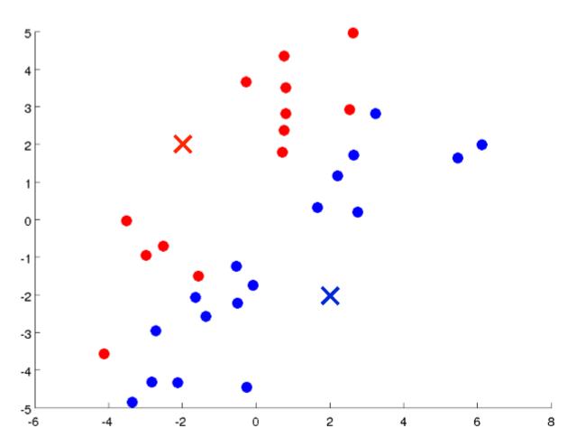

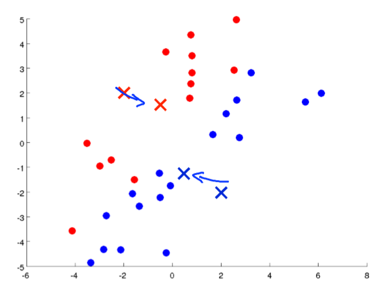

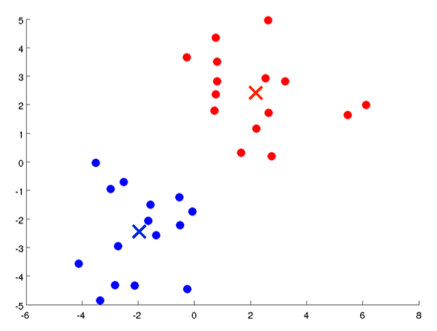

### Optimization Objective

Recall some of the parameters we used in our algorithm:

- $c^{(i)}$ = index of cluster (1,2,...,K) to which example $x^{(i)}$ is currently assigned
- $μ_k$ = cluster centroid k ($μ_k \in \mathbb R^n$)
- $μ_{c^{(i)}}$ = cluster centroid of cluster to which example $x^{(i)}$ has been assigned

Using these variables we can define our **cost function**:
$$
J(c^{(i)},\dots,c^{(m)},\mu_1,\dots,\mu_K) = \dfrac{1}{m}\sum{i=1}^m ||x^{(i)} - \mu_{c^{(i)}}||^2
$$
Our **optimization objective** is to minimize all our parameters using the above cost function:
$$
\min_{c,\mu}\ J(c,\mu)
$$
That is, we are finding all the values in sets $c$, representing all our clusters, and $\mu$, representing all our centroids, that will minimize **the average of the distances** of every training example to its corresponding cluster centroid.

The above cost function is often called the **distortion** of the training examples.

In the **cluster assignment step**, our goal is to:

Minimize $J(\cdots)$ with $c^{(1)},\cdots,c^{(m)}$ (holding $\mu_1,\cdots,\mu_K$ fixed)

In the **move centroid** step, our goal is to:

Minimize $J(\cdots)$ with $\mu_1,\cdots,\mu_K$

With k-means, it is **not possible for the cost function to sometimes increase**. It should always descend.

### Random Initialization

There's one particular recommended method for randomly initializing your cluster centroids.

1. Have $K \lt m$. That is, make sure the number of your clusters is less than the number of your training examples.
2. Randomly pick $K$ training examples. (Not mentioned in the lecture, but also be sure the selected examples are unique).
3. Set $\mu_1,\cdots,\mu_K$ equal to these $K$ examples.

K-means **can get stuck in local optima**. 

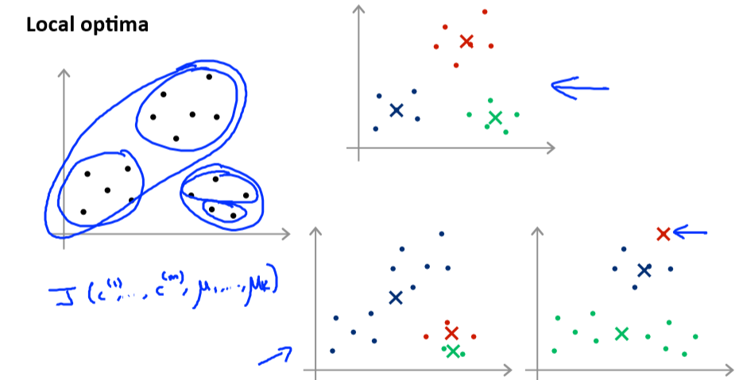

To decrease the chance of this happening, you can run the algorithm on many different random initializations. In cases where $K \lt 10$ it is strongly recommended to run a loop of random initializations.

```
for i = 1 to 100:
   randomly initialize k-means
   run k-means to get 'c' and 'm'
   compute the cost function (distortion) J(c,m)
pick the clustering that gave us the lowest cost
```

### Choosing the Number of Clusters

Choosing K can be quite arbitrary and ambiguous.

1. **The elbow method**: plot the cost $J$ and the number of clusters $K$. The cost function should reduce as we increase the number of clusters, and then flatten out. Choose $K$ at the point where the cost function starts to flatten out.

   However, fairly often, the curve is **very gradual**, so there's no clear elbow.

   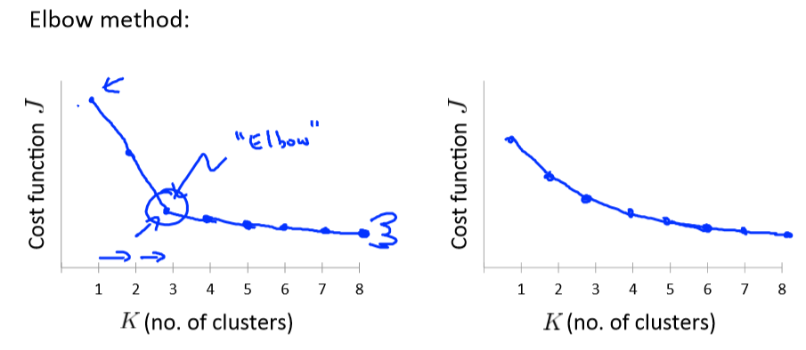

**Note:** J will **always** decrease as $K$ is increased. The one exception is if k-means gets stuck at a bad local optimum.

Another way to choose $K$ is to observe how well k-means performs on a **downstream purpose**. In other words, you choose $K$ that proves to be most useful for some goal you're trying to achieve from using these clusters.

drawbacks of K-Means: https://stats.stackexchange.com/questions/133656/how-to-understand-the-drawbacks-of-k-means

# Dimensionality Reduction

## Motivation

### Motivation I: Data Compression

- We may want to reduce the dimension of our features if we have a lot of redundant data.
- To do this, we find two highly correlated features, plot them, and make a new line that seems to describe both features accurately. We place all the new features on this single line.

Doing dimensionality reduction will reduce the total data we have to store in computer memory and will speed up our learning algorithm.

Note: in dimensionality reduction, we are reducing our features rather than our number of examples. Our variable $m$ will stay the same size; $n$, the number of features each example from $x^{(1)}$ to $x^{(m)}$ carries, will be reduced.

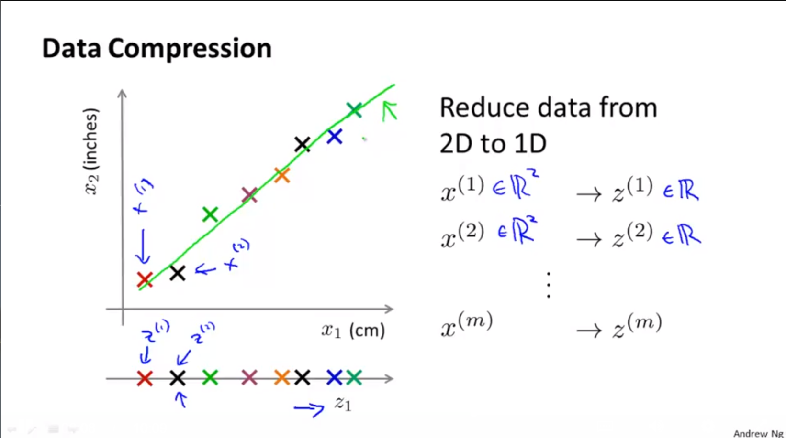

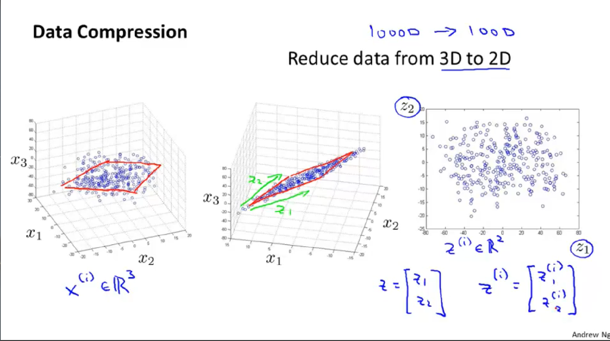

### Motivation II: Visualization

It is not easy to visualize data that is more than three dimensions. We can reduce the dimensions of our data to 3 or less in order to plot it.

We need to find new features, $z_1$, $z_2$(and perhaps $z_3$) that can effectively **summarize** all the other features.

Example: hundreds of features related to a country's economic system may all be combined into one feature that you call "Economic Activity."

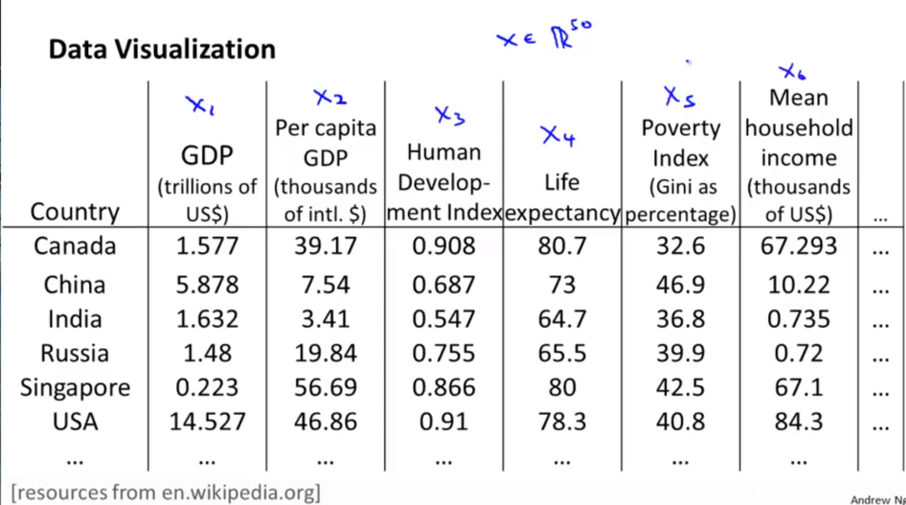

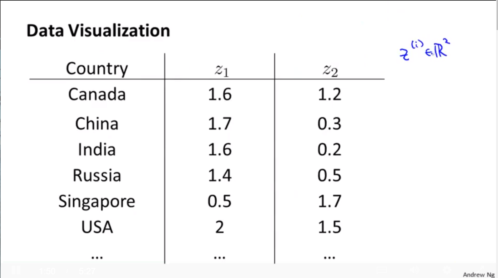

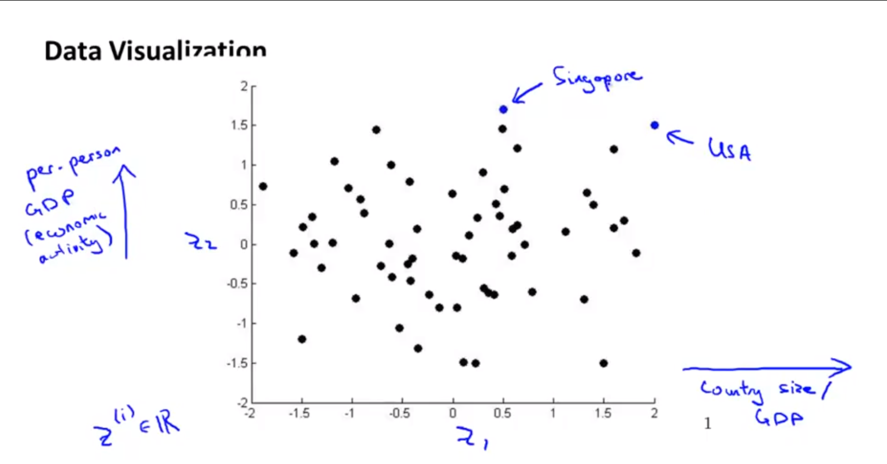

## Principal Component Analysis

### Principal Component Analysis Problem Formulation

The most popular dimensionality reduction algorithm is *Principal Component Analysis* (PCA)

#### Problem formulation

Given two features, $x_1$ and $x_2$, we want to find a single line that effectively describes both features at once. We then map our old features onto this new line to get a new single feature.

The same can be done with three features, where we map them to a plane.

The **goal of PCA** is to **reduce** the average of all the distances of every feature to the projection line. This is the **projection error**.

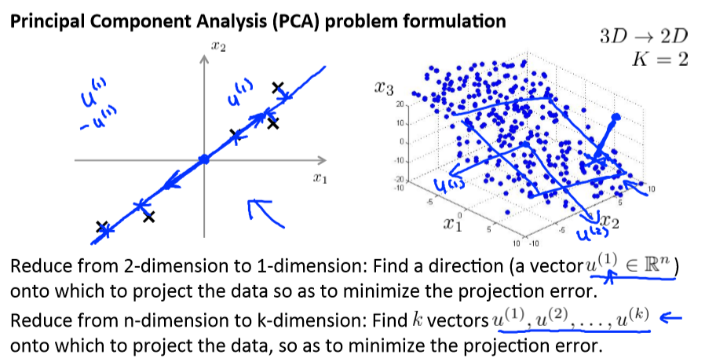

If we are converting from 3d to 2d, we will project our data onto two directions (a plane), so $k$ will be 2.

#### PCA is not linear regression

- In linear regression, we are minimizing the **squared error** from every point to our predictor line. These are vertical distances.
- In PCA, we are minimizing the **shortest distance**, or shortest **orthogonal** distances, to our data points.

More generally

- in linear regression we are taking all our examples in $x$ and applying the parameters in $\Theta$ to predict $y$.

- In PCA, we are taking a number of features $x_1, x_2, \dots, x_n$, and finding a closest common dataset among them. We aren't trying to predict any result and we aren't applying any theta weights to the features.

### Principal Component Analysis Algorithm

Before we can apply PCA, there is a data pre-processing step we must perform:

#### Data preprocessing

feature scaling or mean normalization
$$
x_j^{(i)} = \dfrac{x_j^{(i)} - \mu_j}{s_j}
$$

#### PCA Algorithm

1. Compute "covariance matrix"
   $$
   \Sigma = \dfrac{1}{m}\sum^m_{i=1}(x^{(i)})(x^{(i)})^T = X^TX \in \mathbb R^{n\times n}
   $$


2. Compute "eigenvectors" of covariance matrix $\Sigma$
   $$
   U = (u^{(1)},\cdots,u^{(n)}) \in \mathbb R^{n\times n}
   $$


3. Take the first $k$ columns of the $U$ matrix and compute $z$
   $$
   z^{(i)} = U_{\text{reduce}}^T \cdot x^{(i)}
   $$

   - $U_{\text{reduce}} \in \mathbb R^{n\times k}$ is the first $k$ columns of $U$ 

To summarize, the whole algorithm in octave is roughly:

```matlab
Sigma = (1/m) * X' * X; % compute the covariance matrix
[U,S,V] = svd(Sigma);   % compute our projected directions
Ureduce = U(:,1:k);     % take the first k directions
Z = X * Ureduce;        % compute the projected data points
```

## Applying PCA

### Reconstruction from Compressed Representation

If we use PCA to compress our data, how can we uncompress our data, or go back to our original number of features?

To go from 1-dimension back to 2d we do: $z \in \mathbb{R} \rightarrow x \in \mathbb{R}^2$.

We can do this with the equation: $x_{approx}^{(1)} = U_{reduce} \cdot z^{(1)}$.

Note that we can only get **approximations** of our original data.

**Note**: It turns out that the $U$ matrix has the special property that it is a Unitary Matrix. One of the special properties of a Unitary Matrix is:

$U^{-1} = U^∗$ where the "*" means "conjugate transpose".

Since we are dealing with real numbers here, this is equivalent to:

$U^{-1} = U^T$ So we could compute the inverse and use that, but it would be a waste of energy and compute cycles.

### Choosing the Number of Principal Components

How do we choose $k$, also called the **number of principal components**? Recall that $k$ is the dimension we are reducing to.

One way to choose $k$ is by using the following formula:

- Given the average squared projection error: $\dfrac{1}{m}\sum^m_{i=1}||x^{(i)} - x_{approx}^{(i)}||^2$
- Also given the total **variation** in the data: $\dfrac{1}{m}\sum^m_{i=1}||x^{(i)}||^2$ 
  - notice that we have done normalization and feature scaling so the mean of $x^{(i)}$ is 0
- Choose $k$ to be the smallest value such that: $\dfrac{\dfrac{1}{m}\sum^m_{i=1}||x^{(i)} - x_{approx}^{(i)}||^2}{\dfrac{1}{m}\sum^m_{i=1}||x^{(i)}||^2} \leq 0.01$

In other words, the squared projection error divided by the total variation should be less than one percent, so that **99% of the variance is retained**.

**Algorithm for choosing k**

1. Try PCA with $k = 1,2, \cdots$
2. Compute $U_{\text{reduce}},z,x$
3. Check the formula given above that 99% of the variance is retained. If not, go to step one and increase $k$.

This procedure would actually be horribly inefficient. In Octave, we will call `svd`:

```matlab
[U,S,V] = svd(Sigma)
```

Which gives us a matrix $S$. We can actually check for 99% of retained variance using the S matrix as follows:
$$
\dfrac{\sum_{i=1}^kS_{ii}}{\sum_{i=1}^nS_{ii}} \geq 0.99
$$

### Advice for Applying PCA

#### Supervised learning speedup

Given a training set with a large number of features (e.g. $x^{(1)},\dots,x^{(m)} \in \mathbb{R}^{10000}$ ) we can use PCA to reduce the number of features in each example of the training set (e.g. $z^{(1)},\dots,z^{(m)} \in \mathbb{R}^{1000}$).

Note that we should **define** the PCA reduction from $x^{(i)}$ to $z^{(i)}$ only on the training set and not on the cross-validation or test sets. You can **apply** the mapping $z^{(i)}$ to your cross-validation and test sets after it is defined on the training set.

#### Applications

- Compressions
  - Reduce space of data
  - Speed up algorithm


- Visualization of data
  - Choose $k = 2$ or $k = 3$

#### Bad use of PCA

trying to prevent overfitting. We might think that reducing the features with PCA would be an effective way to address overfitting. It might work, but is not recommended because it does not consider the values of our results $y$. Using just regularization will be at least as effective.

Don't assume you need to do PCA. **Try your full machine learning algorithm without PCA first.** Then use PCA if you find that you need it.