# Anomaly Detection

## Density Estimation

### Problem Motivation

Just like in other learning problems, we are given a dataset ${x^{(1)}, x^{(2)},\dots,x^{(m)}}$.

We are then given a new example, $x_{\text{test}}$, and we want to know whether this new example is abnormal/anomalous.

We define a "model" $p(x)$ that tells us the **probability** the example is not anomalous. We also use a threshold $\varepsilon$ (epsilon) as a dividing line so we can say which examples are anomalous and which are not.

A very common application of anomaly detection is detecting fraud:

- $x^{(i)}$= features of user $i$'s activities
- Model $p(x)$ from the data.
- Identify unusual users by checking which have $p(x) \lt \varepsilon$.

If our anomaly detector is flagging **too many** anomalous examples, then we need to **decrease** our threshold $\varepsilon$

### Gaussian Distribution

The Gaussian Distribution is a familiar bell-shaped curve that can be described by a function $N(\mu, \sigma^2)$

Let $x \in \mathbb R$. If the probability distribution of $x$ is Gaussian with mean $\mu$, variance $\sigma^2$, then:
$$
x \sim \mathcal{N}(\mu, \sigma^2)
$$

probability density function

$$
\large p(x;\mu,\sigma^2) = \dfrac{1}{\sigma\sqrt{(2\pi)}}e^{-\dfrac{1}{2}(\dfrac{x - \mu}{\sigma})^2}
$$
estimated mean and variance
$$
\hat\mu = \dfrac{1}{m}\displaystyle \sum_{i=1}^m x^{(i)} \\
\hat\sigma^2 = \dfrac{1}{m}\displaystyle \sum_{i=1}^m(x^{(i)} - \mu)^2
$$
### Algorithm

Given a training set of examples, $\lbrace {x^{(1)}, x^{(2)},\dots,x^{(m)}} \rbrace$ where each example is a vector, $x \in \mathbb R^n$

Assume $x^{(i)}$ is independent
$$
p(x)= \displaystyle \prod^n_{j=1} p(x_j;\mu_j,\sigma_j^2)
$$
**The algorithm**

- Choose features $x_i$ that you think might be indicative of anomalous examples.

- Fit parameters $\mu_1,\dots,\mu_n,\sigma_1^2,\dots,\sigma_n^2$

  - Calculate $\mu_j = \dfrac{1}{m}\displaystyle \sum_{i=1}^m x_j^{(i)}$
  - Calculate $\sigma^2_j = \dfrac{1}{m}\displaystyle \sum_{i=1}^m(x_j^{(i)} - \mu_j)^2$

- Given a new example $ x$, compute $p(x)$:
  $$
  p(x) = \displaystyle \prod^n_{j=1} p(x_j;\mu_j,\sigma_j^2) = \prod\limits^n_{j=1} \dfrac{1}{\sqrt{2\pi}\sigma_j}exp(-\dfrac{(x_j - \mu_j)^2}{2\sigma^2_j})
  $$

  - Anomaly if $p(x) \lt \varepsilon$

A vectorized version of the calculation for $\mu$ is $\mu = \dfrac{1}{m}\displaystyle \sum_{i=1}^m x^{(i)}$. You can vectorize $\sigma^2$ similarly.

example:

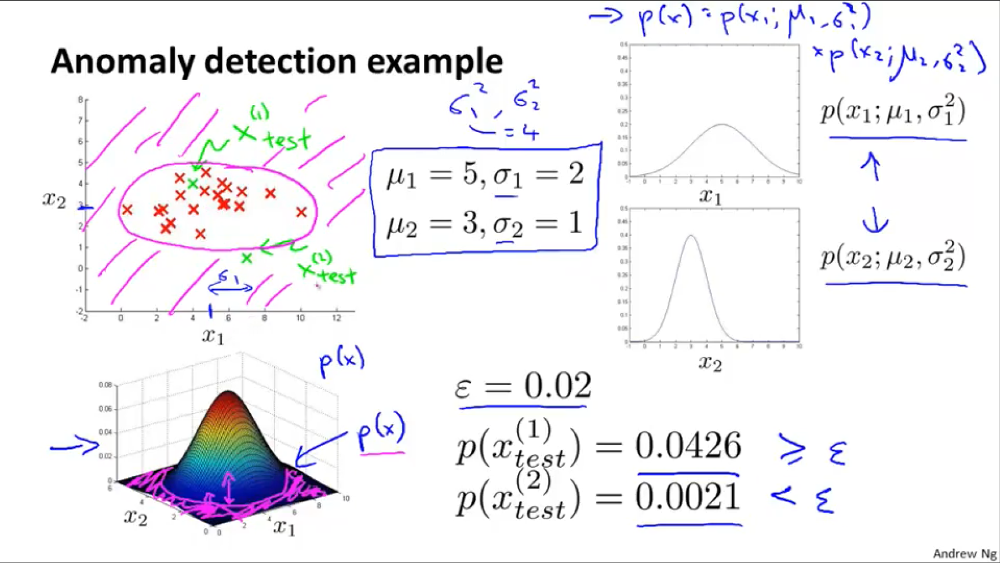

## Building an Anomaly Detection System

### Developing and Evaluating an Anomaly Detection System

To evaluate our learning algorithm, we take some labeled data, categorized into anomalous and non-anomalous examples ( $y = 0$ if normal, $y = 1$ if anomalous).

Among that data, take a large proportion of **good**, non-anomalous data for the training set on which to train $p(x)$.

Then, take a smaller proportion of mixed anomalous and non-anomalous examples (you will usually have many more non-anomalous examples) for your cross-validation and test sets.

> For example, we may have a set where 0.2% of the data is anomalous. We take 60% of those examples, all of which are good (y=0) for the training set. We then take 20% of the examples for the cross-validation set (with 0.1% of the anomalous examples) and another 20% from the test set (with another 0.1% of the anomalous).

In other words, we split the data 60/20/20 training/CV/test and then split the anomalous examples 50/50 between the CV and test sets.

**Algorithm evaluation:**

Fit model $p(x)$ on training set $\lbrace {x^{(1)}, x^{(2)},\dots,x^{(m)}} \rbrace$

On a cross validation/test example x, predict:

If $p(x) \lt \varepsilon$ (**anomaly**), then $y=1$

If $p(x) \geq \varepsilon$ (**normal**), then $y=0$

Possible evaluation metrics (see "Machine Learning System Design" section):

- True positive, false positive, false negative, true negative.
- Precision/recall
- F1 score

Note that we use the cross-validation set to choose parameter $\varepsilon$

### Anomaly Detection vs. Supervised Learning

When do we use anomaly detection and when do we use supervised learning?

Use anomaly detection when...

- We have a very small number of positive examples (y=1 ... 0-20 examples is common) and a large number of negative (y=0) examples.
- We have many different "types" of anomalies and it is hard for any algorithm to learn from positive examples what the anomalies look like; future anomalies may look nothing like any of the anomalous examples we've seen so far.

Use supervised learning when...

- We have a large number of both positive and negative examples. In other words, the training set is more evenly divided into classes.
- We have enough positive examples for the algorithm to get a sense of what new positives examples look like. The future positive examples are likely similar to the ones in the training set.

application

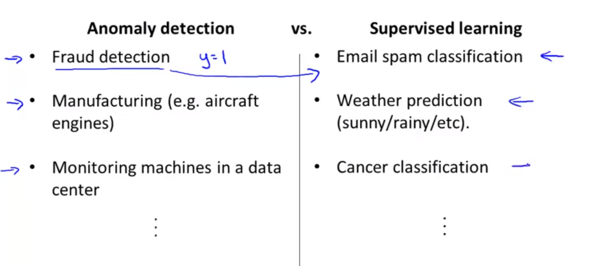

### Choosing What Features to Use

The features will greatly affect how well your anomaly detection algorithm works.

We can check that our features are **gaussian** by plotting a histogram (`hist()`) of our data and checking for the bell-shaped curve. 

Some **transforms** we can try on an example feature x that does not have the bell-shaped curve are:

- $\log(x)$
- $\log(x+1)$
- $\log(x+c)$ for some constant
- $\sqrt x$
- $x^{\frac{1}{3}}$

We can play with each of these to try and achieve the gaussian shape in our data.

There is an **error analysis procedure** for anomaly detection that is very similar to the one in supervised learning.

Our goal is for $p(x)$ to be large for normal examples and small for anomalous examples.

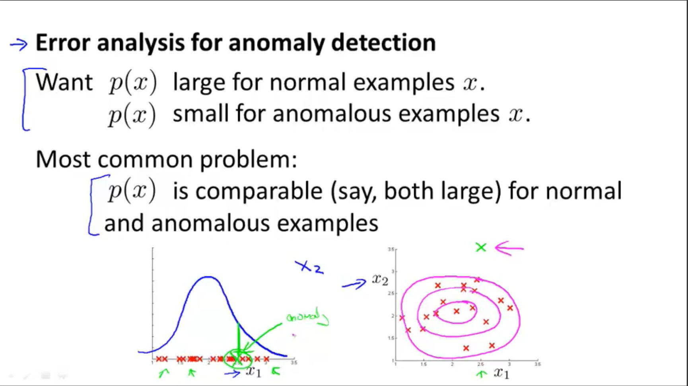

One common problem is when $p(x)$ is similar for both types of examples. In this case, you need to examine the anomalous examples that are giving high probability in detail and try to figure out new features that will better distinguish the data.

In general, choose features that might take on unusually large or small values in the event of an anomaly.

example:

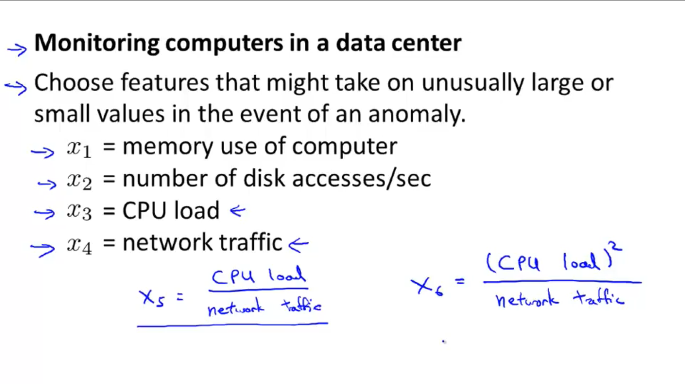

- $x_5$ and $x_6$ can help capture whether a computer is stuck in an infinite loop

## Multivariate Gaussian Distribution

### Multivariate Gaussian Distribution (Optional)

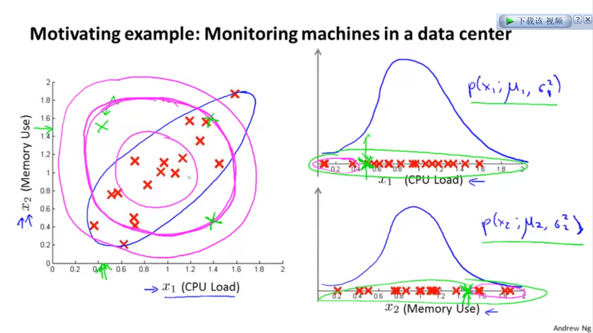

The multivariate gaussian distribution is an extension of anomaly detection and may (or may not) catch more anomalies.

Instead of modeling $p(x_1),p(x_2), \cdots$ separately, we will model $p(x)$ all in one go. Our parameters will be: $\mu \in \mathbb R^n$ and $\Sigma \in \mathbb R^{n×n}$

$$
p(x;\mu,\Sigma) = \dfrac{1}{(2\pi)^{n/2} |\Sigma|^{1/2}} exp(-1/2(x-\mu)^T\Sigma^{-1}(x-\mu))
$$
The important effect is that we can model oblong gaussian contours, allowing us to better fit data that might not fit into the normal circular contours.

Varying $\Sigma$ changes the shape, width, and orientation of the contours. Changing $\mu$ will move the center of the distribution.

example:

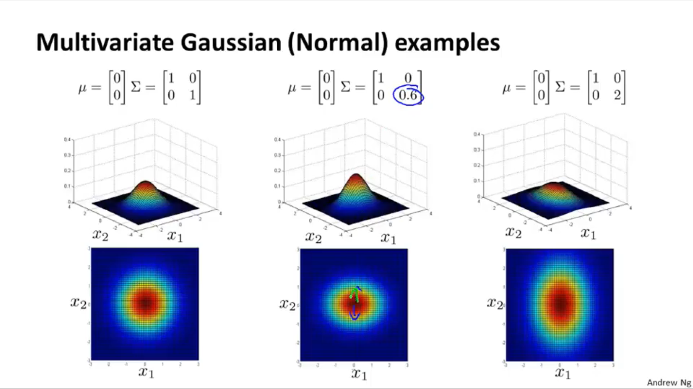

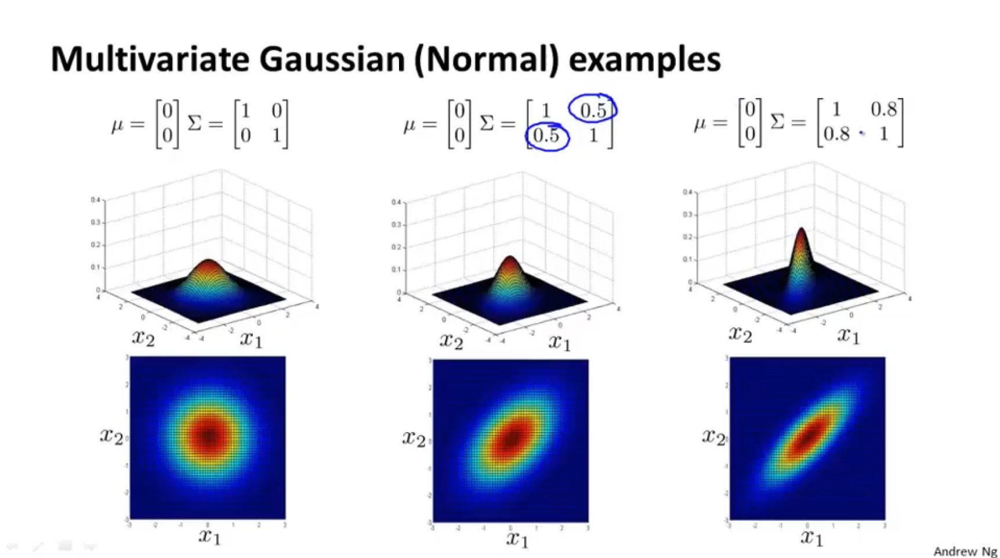

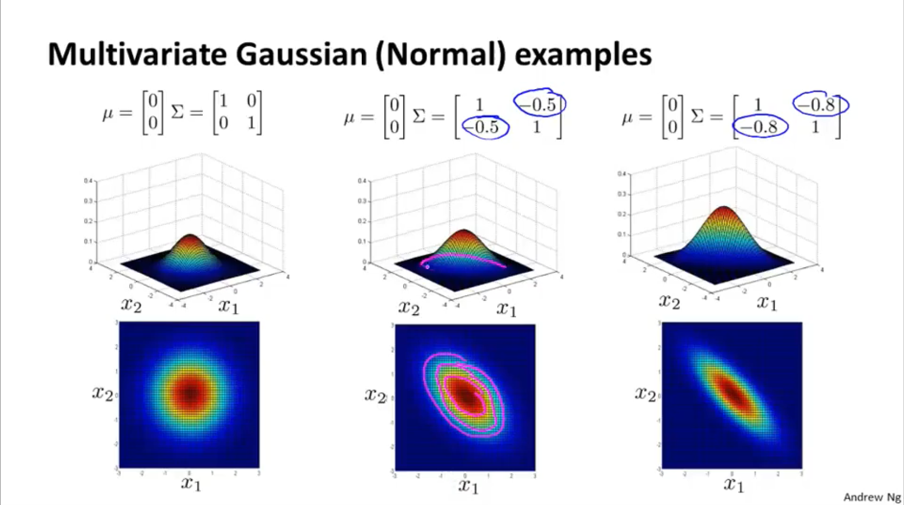

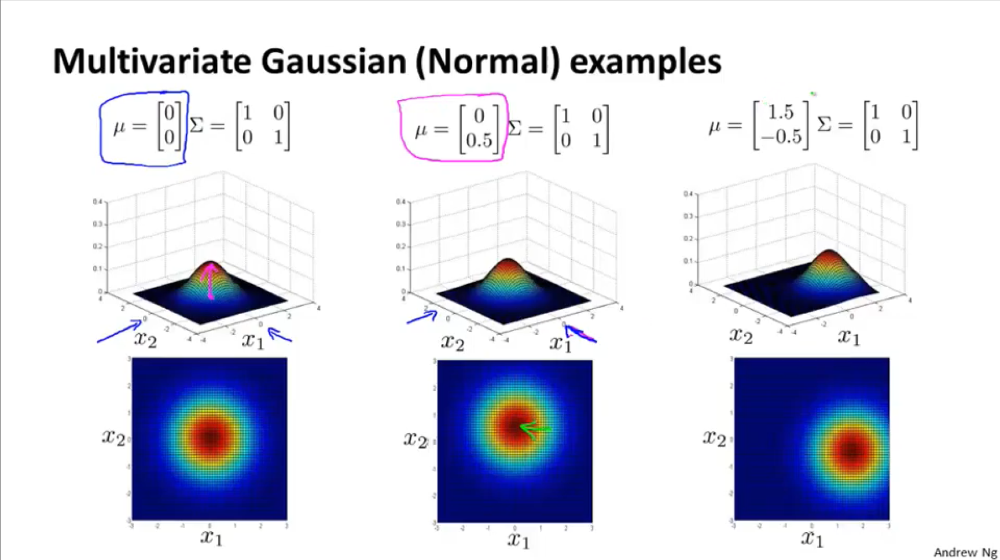

Check also:

- [The Multivariate Gaussian Distribution](http://cs229.stanford.edu/section/gaussians.pdf) <http://cs229.stanford.edu/section/gaussians.pdf> Chuong B. Do, October 10, 2008.

### Anomaly Detection using the Multivariate Gaussian Distribution (Optional)

When doing anomaly detection with multivariate gaussian distribution, we compute $\mu$ and $\Sigma$ normally. We then compute $p(x)$ using the new formula in the previous section and flag an anomaly if $p(x) \lt \varepsilon$.

The original model for $p(x)$ corresponds to a multivariate Gaussian where the contours of $p(x; \mu, \Sigma)$ are axis-aligned.

The multivariate Gaussian model can automatically capture correlations between different features of $x$.

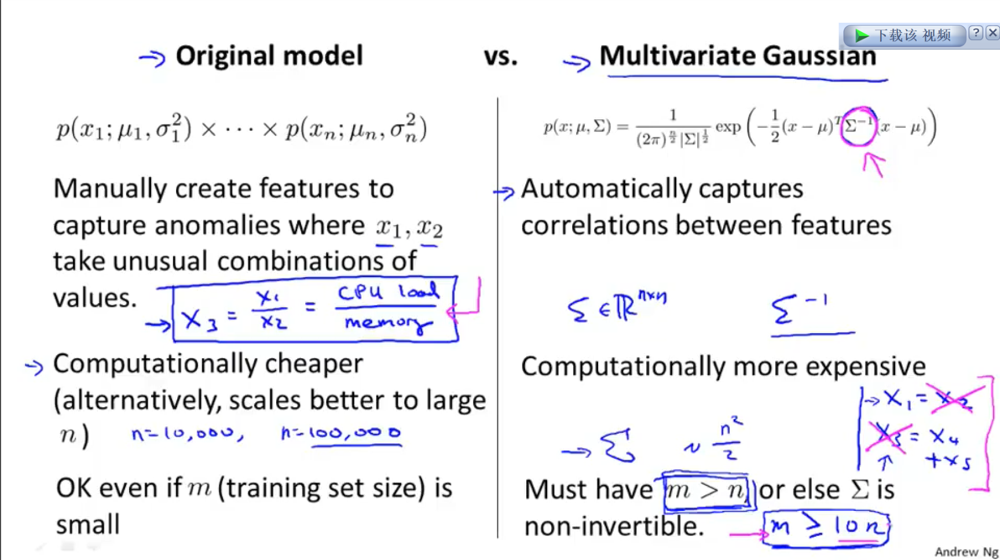

# Recommender Systems

## Predicting Movie Ratings

### Problem Formulation

Recommendation is currently a very popular application of machine learning.

Say we are trying to recommend movies to customers. We can use the following definitions

- $n_u$= number of users
- $n_m$= number of movies
- $r(i,j)=1$ if user j has rated movie i
- $y^{(i,j)}$= rating given by user j to movie i (defined only if $r(i,j)=1$)

### Content Based Recommendations

We can introduce two features, $x_1$ and $x_2$ which represents how much romance or how much action a movie may have (on a scale of 0−1).

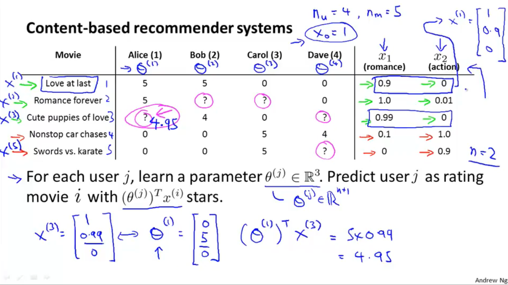

One approach is that we could do linear regression for every single user. For each user $j$, learn a parameter $θ^{(j)} \in \mathbb R^3$. Predict user $j$ as rating movie $i$ with $(θ^{(j)})^Tx^{(i)}$ stars.

- $θ^{(j)}$= parameter vector for user $j$
- $x^{(i)}$= feature vector for movie $i$

For user $j$, movie $i$, predicted rating: $(θ^{(j)})^Tx^{(i)}$

- $m^{(j)}$= number of movies rated by user $j$

To learn $θ^{(j)}$, we do the following
$$
\min_{\theta^{(j)}} = \dfrac{1}{2}\displaystyle \sum_{i:r(i,j)=1} ((\theta^{(j)})^T(x^{(i)}) - y^{(i,j)})^2 + \dfrac{\lambda}{2} \sum_{k=1}^n(\theta_k^{(j)})^2
$$
This is our familiar linear regression. The base of the first summation is choosing all i such that $r(i,j)=1$.

To get the parameters for all our users, we do the following:
$$
\min_{\theta^{(1)},\dots,\theta^{(n_u)}} = \dfrac{1}{2}\displaystyle \sum_{j=1}^{n_u}  \sum_{i:r(i,j)=1} ((\theta^{(j)})^T(x^{(i)}) - y^{(i,j)})^2 + \dfrac{\lambda}{2} \sum_{j=1}^{n_u} \sum_{k=1}^n(\theta_k^{(j)})^2
$$
We can apply our linear regression gradient descent update using the above cost function.

The only real difference is that we **eliminate the constant **$\dfrac{1}{m}$.

## Collaborative Filtering

### Collaborative Filtering

It can be very difficult to find features such as "amount of romance" or "amount of action" in a movie. To figure this out, we can use *feature finders*.

We can let the users tell us how much they like the different genres, providing their parameter vector immediately for us.

To infer the features from given parameters, we use the squared error function with regularization over all the users:
$$
\min_{x^{(1)},\dots,x^{(n_m)}} \dfrac{1}{2} \displaystyle \sum_{i=1}^{n_m}  \sum_{j:r(i,j)=1} ((\theta^{(j)})^T x^{(i)} - y^{(i,j)})^2 + \dfrac{\lambda}{2}\sum_{i=1}^{n_m} \sum_{k=1}^{n} (x_k^{(i)})^2
$$
You can also **randomly guess** the values for theta to guess the features repeatedly. You will actually converge to a good set of features.

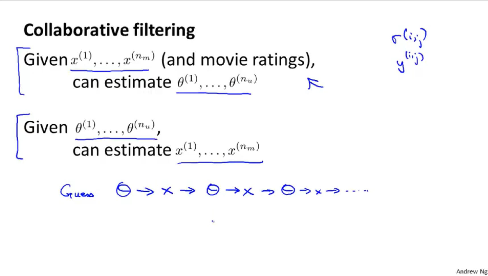

### Collaborative Filtering Algorithm

To speed things up, we can simultaneously minimize our features and our parameters:
$$
J(x,\theta) = \dfrac{1}{2} \displaystyle \sum_{(i,j):r(i,j)=1}((\theta^{(j)})^Tx^{(i)} - y^{(i,j)})^2 + \dfrac{\lambda}{2}\sum_{i=1}^{n_m} \sum_{k=1}^{n} (x_k^{(i)})^2 + \dfrac{\lambda}{2}\sum_{j=1}^{n_u} \sum_{k=1}^{n} (\theta_k^{(j)})^2
$$
It looks very complicated, but we've only combined the cost function for $\Theta$ and the cost function for $x$.

Because the algorithm can learn them itself, the bias units where $x_0=1$ have been removed, therefore $x \in \mathbb R^n$ and $\theta \in \mathbb R^n$.

These are the steps in the algorithm:

1. Initialize $x^{(i)}, \cdots ,x^{(n_m)},\theta^{(1)}, \cdots ,\theta^{(n_u)}$ to small random values. This serves to **break symmetry** and ensures that the algorithm learns features $x^{(i)}, \cdots ,x^{(n_m)}$ that are different from each other.
2. Minimize $J(x^{(i)},...,x^{(n_m)},\theta^{(1)},...,\theta^{(n_u)})$ using gradient descent (or an advanced optimization algorithm).E.g. for every $j=1, \cdots ,n_u,i=1, \cdots n_m$:
   - $x_k^{(i)} := x_k^{(i)} - \alpha\left (\sum_{j:r(i,j)=1}{((\theta^{(j)})^T x^{(i)} - y^{(i,j)}) \theta_k^{(j)}} + \lambda x_k^{(i)} \right)$
   - $\theta_k^{(j)} := \theta_k^{(j)} - \alpha\left ( \sum_{i:r(i,j)=1}{((\theta^{(j)})^T x^{(i)} - y^{(i,j)}) x_k^{(i)}} + \lambda \theta_k^{(j)} \right)$
3. For a user with parameters $\theta$ and a movie with (learned) features $x$, predict a star rating of $\theta ^T x$.

## Low Rank Matrix Factorization

### Vectorization: Low Rank Matrix Factorization

Given matrices $X$ (each row containing features of a particular movie) and $\Theta$ (each row containing the weights for those features for a given user), then the full matrix $Y$ of all predicted ratings of all movies by all users is given simply by: $Y=X \Theta^T$.

Predicting how similar two movies $i$ and $j$ are can be done using the distance between their respective feature vectors $x$. Specifically, we are looking for a small value of $||x^{(i)} - x^{(j)}||$.

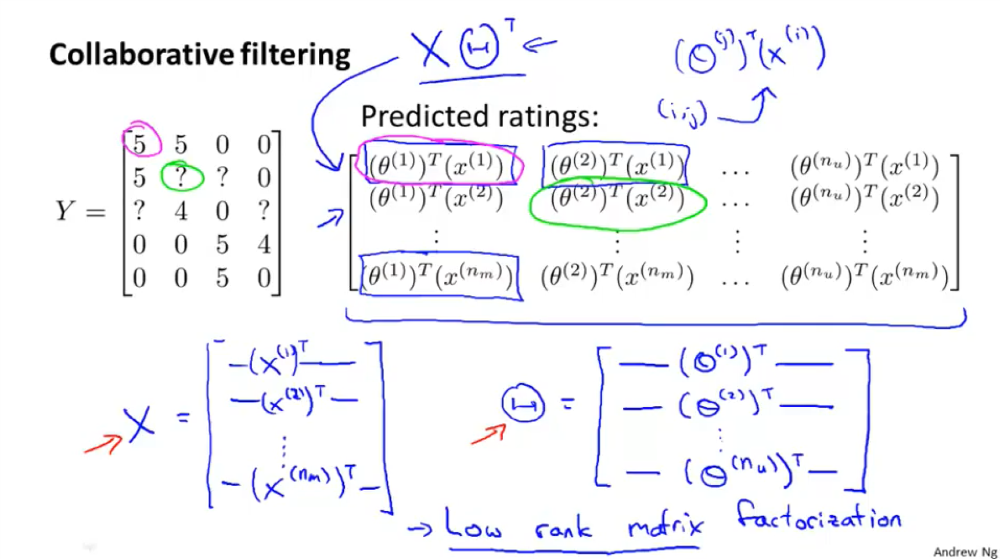

### Implementation Detail: Mean Normalization

If the ranking system for movies is used from the previous lectures, then new users (who have watched no movies), will be assigned new movies incorrectly. Specifically, they will be assigned $\theta$ with all components equal to 0 due to the minimization of the regularization term. That is, we assume that the new user will rank all movies 0, which does not seem intuitively correct.

We rectify this problem by normalizing the data relative to the mean. First, we use a matrix $Y$ to store the data from previous ratings, where the $i^{th}$ row of $Y$ is the ratings for the $^{th}$ movie and the $j^{th}$ column corresponds to the ratings for the $j^{th}$ user.

We can now define a vector
$$
\mu  = [\mu_1, \mu_2, \dots , \mu_{n_m}]
$$
such that
$$
\mu_i = \frac{\sum_{j:r(i,j)=1}{Y_{i,j}}}{\sum_{j}{r(i,j)}}
$$
Which is effectively the mean of the previous ratings for the $i^{th}$ movie (where only movies that have been watched by users are counted). We now can normalize the data by subtracting u, the mean rating, from the actual ratings for each user (column in matrix $Y$):

As an example, consider the following matrix $Y$ and mean ratings $\mu$:
$$
Y = 
\begin{bmatrix}
    5 & 5 & 0 & 0  \newline
    4 & ? & ? & 0  \newline
    0 & 0 & 5 & 4 \newline
    0 & 0 & 5 & 0 \newline
\end{bmatrix}, \quad
 \mu = 
\begin{bmatrix}
    2.5 \newline
    2  \newline
    2.25 \newline
    1.25 \newline
\end{bmatrix}
$$
The resulting $Y$′ vector is:
$$
Y' =
\begin{bmatrix}
  2.5    & 2.5   & -2.5 & -2.5 \newline
  2      & ?     & ?    & -2 \newline
  -.2.25 & -2.25 & 3.75 & 1.25 \newline
  -1.25  & -1.25 & 3.75 & -1.25
\end{bmatrix}
$$
Now we must slightly modify the linear regression **prediction** to include the mean normalization term:
$$
(\theta^{(j)})^T x^{(i)} + \mu_i
$$
Now, for a new user, the initial predicted values will be equal to the $\mu$ term instead of simply being initialized to zero, which is more accurate.

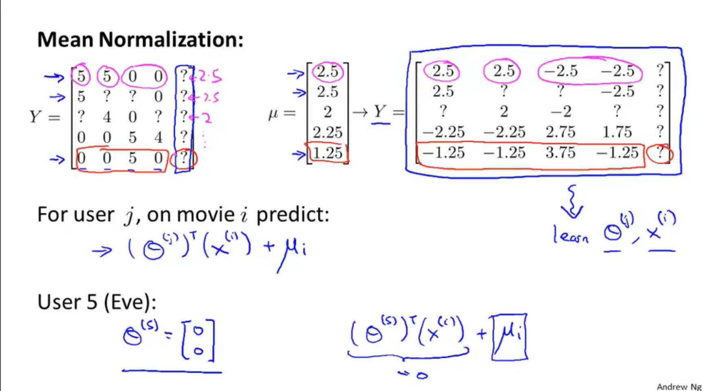

