# Application Example: Photo OCR

## Photo OCR

### Problem Description and Pipeline

Photo OCR stands for Photo Optical Character Recognition

given an image

1. Text detection
2. Character segmentation
3. Character classification

Machine learning pipeline: A system with many stages/components, several of which may use machine learning.

### Sliding Windows

pedestrian detection is maybe slightly simpler than text detection just for the reason that the aspect ratio of most pedestrians are pretty similar. Just using a fixed aspect ratio for these rectangles that we're trying to find. 

> ratio mean the ratio between the height and the width of those rectangles. 

- first train a classifier for single pedestrian detection

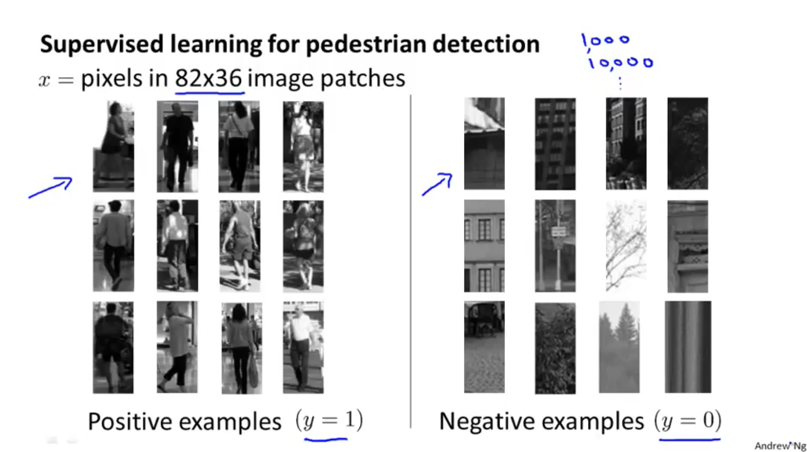

- slide window: slide through picture and resize window

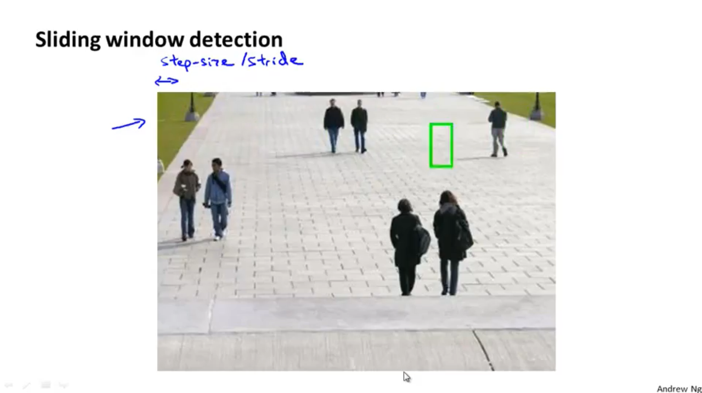

#### Text

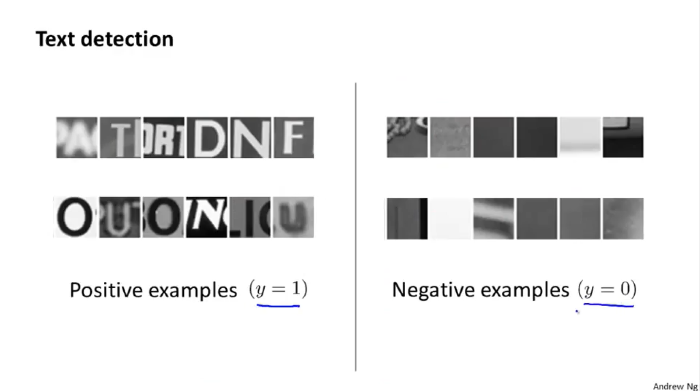

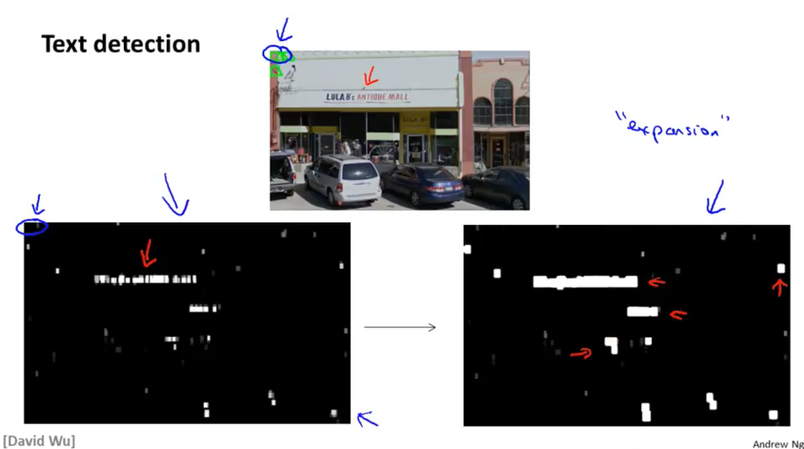

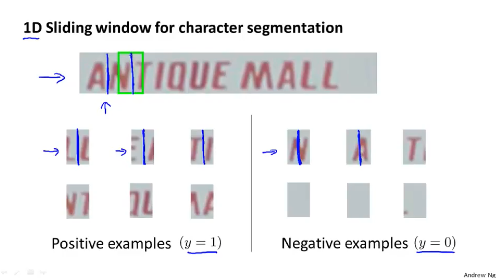

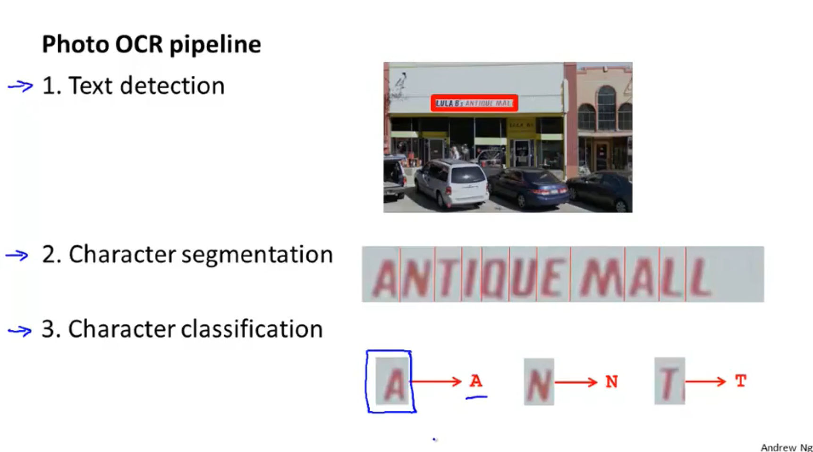

### Getting Lots of Data and Artificial Data

synthesizing data

- create new data from scratch

pick character from font library to  random background

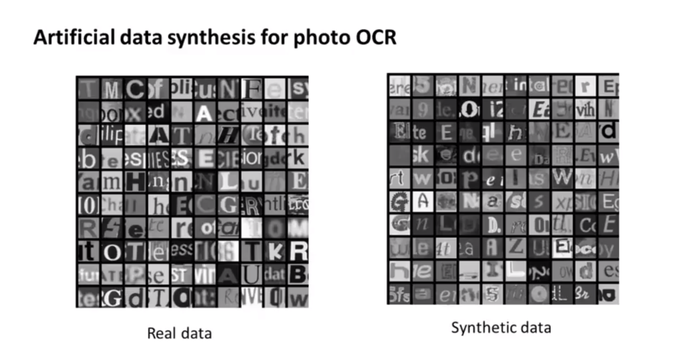

- amplify training sets

  - distortions

  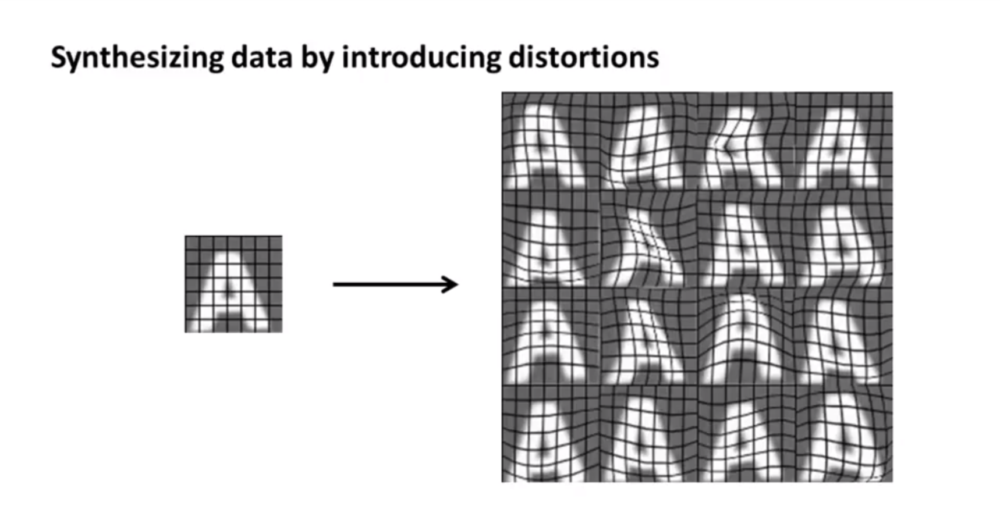

distortions should be meaningful

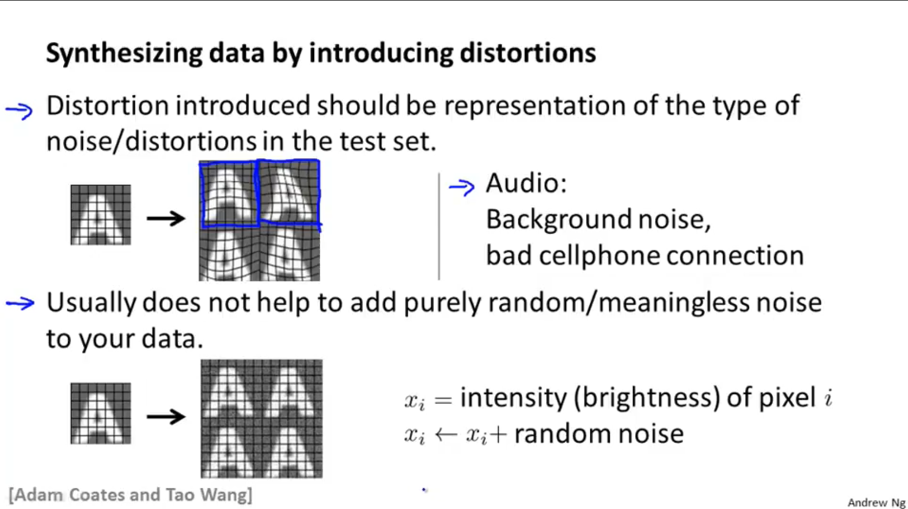

Discussion on getting more data

1. Make sure you have a low bias classifier before expending the effort. (Plot learning curves.) E.g. keep increasing the number of features/number of hidden units in neural network until you have a low bias classifier
2. "How much work would it be to get 10x as much data as we currently have?"
   - artificial data synthesis
   - collect/label it yourself
   - Crowd source (E.g. Amazon Mechanical Turk)

### Ceiling Analysis: What Part of the Pipeline to Work on Next

When you're the team working on the pipeline machine on your system, **ceiling analysis** can sometimes give you a very strong signal, a very strong guidance on what parts of the pipeline might be the best use of your time to work on. 

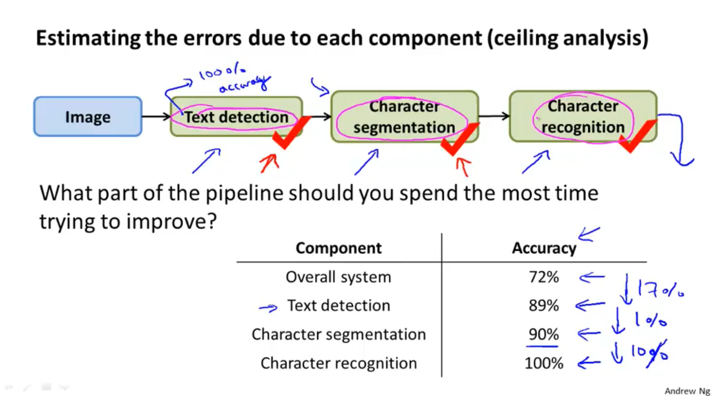

- first compute overall system accuracy (could be other metric)
- repeat for all component $i$
  - manually pick test sets so that the component $i$ have 100% accuracy and then computer system accuracy, see how much better performance we can get
- the component with biggest growth are most likely to have a significant impact on the performance of the final system.

benefit of performing ceiling analysis

- It can help indicate that certain components of a system might not be worth a significant amount of work improving, because even if it had perfect performance its impact on the overall system may be small.
- It gives us information about which components, if improved, are most likely to have a significant impact on the performance of the final system.

## Conclusion

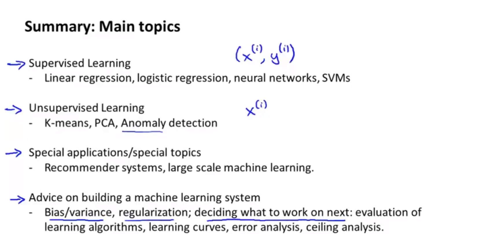

