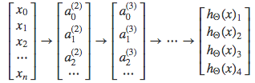

# Neural Networks

## Motivations

### Non-linear Hypotheses

with the growth of number of features, the polynomial terms grows incredibly. It's hard to apply linear regression or logistic regression.

another example: computer vision, each pixel in the picture is a feature.

### Neurons and the Brains

Origins: Algorithms that try to mimic the brain

was very widely used in 80s and early 90s; popularity diminished in late 90s

Recent resurgence with the fast growth of computability: State-of-the-art technique for many applications.

the brain tissue can be rewired and learn new ability which it doesn't have before. for example, auditory cortex can learn to 'see'

## Neural Networks

### Model Representation I

Let's examine how we will represent a hypothesis function using neural networks. 

At a very simple level, neurons are basically computational units that take inputs (**dendrites**) as electrical inputs (called "spikes") that are channeled to outputs (**axons**). In our model: 

- dendrites: input features $x_1\cdots x_n$
- output: result of our hypothesis function. 

In this model our $x_0$ input node is sometimes called the "**bias unit**." It is always equal to 1. In neural networks, we use the same logistic function as in classification,  yet we sometimes call it a **sigmoid (logistic) activation function**. In this situation, our "theta" parameters are sometimes called "**weights**".

Visually, a simplistic representation looks like:
$$
\begin{bmatrix}x_0 \newline x_1 \newline x_2 \newline \end{bmatrix}\rightarrow\begin{bmatrix}\ \ \ \newline \end{bmatrix}\rightarrow h_\theta(x)
$$

- input layer
- hidden layer
- output layer

In this example, we label these intermediate or "hidden" layer nodes $a^2_0 \cdots a^2_n$ and call them "**activation units**."
$$
\begin{align*}& a_i^{(j)} = \text{"activation" of unit $i$ in layer $j$} \newline& \Theta^{(j)} = \text{matrix of weights controlling function mapping from layer $j$ to layer $j+1$}\end{align*}
$$
If we had one hidden layer, it would look like:
$$
\begin{bmatrix}x_0 \newline x_1 \newline x_2 \newline x_3\end{bmatrix}\rightarrow\begin{bmatrix}a_1^{(2)} \newline a_2^{(2)} \newline a_3^{(2)} \newline \end{bmatrix}\rightarrow h_\theta(x)
$$

The values for each of the "activation" nodes is obtained as follows:
$$
\begin{align*} a_1^{(2)} = g(\Theta_{10}^{(1)}x_0 + \Theta_{11}^{(1)}x_1 + \Theta_{12}^{(1)}x_2 + \Theta_{13}^{(1)}x_3) \newline a_2^{(2)} = g(\Theta_{20}^{(1)}x_0 + \Theta_{21}^{(1)}x_1 + \Theta_{22}^{(1)}x_2 + \Theta_{23}^{(1)}x_3) \newline a_3^{(2)} = g(\Theta_{30}^{(1)}x_0 + \Theta_{31}^{(1)}x_1 + \Theta_{32}^{(1)}x_2 + \Theta_{33}^{(1)}x_3) \newline h_\Theta(x) = a_1^{(3)} = g(\Theta_{10}^{(2)}a_0^{(2)} + \Theta_{11}^{(2)}a_1^{(2)} + \Theta_{12}^{(2)}a_2^{(2)} + \Theta_{13}^{(2)}a_3^{(2)}) \newline \end{align*}
$$

This is saying that we compute our activation nodes by using a 3×4 matrix of parameters. We apply each row of the parameters to our inputs to obtain the value for one activation node. Our hypothesis output is the logistic function applied to the sum of the values of our activation nodes, which have been multiplied by yet another parameter matrix $\Theta^{(2)}$ containing the weights for our second layer of nodes.

**Each layer gets its own matrix of weights, $\Theta^{(j)}$.**

The dimensions of these matrices of weights is determined as follows:

$$
\text{If network has $s_j$ units in layer $j$ and $s_{j+1}$ units in layer $j+1$, then $\Theta^{(j)}$ will be of dimension $s_{j+1} \times (s_j + 1)$.}
$$
The +1 comes from the addition in $\Theta^{(j)}$ of the "bias nodes," $x_0$ and $\Theta^{(j)}_0$. In other words the output nodes will not include the bias nodes while the inputs will. The following image summarizes our model representation:

### Model Representation III

In this section we'll do a **vectorized implementation** of the above functions. We're going to define a new variable $z^{(j)}_k$ that encompasses the parameters inside our g function. In our previous example if we replaced by the variable $z$ for all the parameters we would get:
$$
\begin{align*}a_1^{(2)} = g(z_1^{(2)}) \newline a_2^{(2)} = g(z_2^{(2)}) \newline a_3^{(2)} = g(z_3^{(2)}) \newline \end{align*}
$$
In other words, for layer $j=2$ and node $k$, the variable $z$ will be:
$$
z_k^{(2)} = \Theta_{k,0}^{(1)}x_0 + \Theta_{k,1}^{(1)}x_1 + \cdots + \Theta_{k,n}^{(1)}x_n
$$
The vector representation of $x$ and $z_j$ is:
$$
\begin{align*}x = \begin{bmatrix}x_0 \newline x_1 \newline\cdots \newline x_n\end{bmatrix} &z^{(j)} = \begin{bmatrix}z_1^{(j)} \newline z_2^{(j)} \newline\cdots \newline z_n^{(j)}\end{bmatrix}\end{align*}
$$
Setting $x=a^{(1)}$, we can rewrite the equation as:
$$
z^{(j)} = \Theta^{(j-1)}a^{(j-1)}
$$

Now we can get a vector of our activation nodes for layer j as follows:
$$
a^{(j)} = g(z^{(j)})
$$
Where our function g can be applied element-wise to our vector $z^{(j)}$.

We can then add a bias unit (equal to 1) to layer j after we have computed $a^{(j)}$. This will be element $a^{(j)}_0$ and will be equal to 1. To compute our final hypothesis, let's first compute another z vector:
$$
z^{(j+1)} = \Theta^{(j)}a^{(j)}
$$
We get this final z vector by multiplying the next theta matrix after $\Theta^{(j−1)}$ with the values of all the activation nodes we just got. This last theta matrix $\Theta^{(j)}$ will have only **one row **which is multiplied by one column $a^{(j)}$ so that our result is a single number. We then get our final result with:
$$
h_\Theta(x) = a^{(j+1)} = g(z^{(j+1)})
$$
Notice that in this **last step**, between layer j and layer j+1, we are doing **exactly the same thing** as we did in logistic regression. Adding all these intermediate layers in neural networks allows us to more elegantly produce interesting and more complex non-linear hypotheses.

## Applications

### Logic Gates

The $\Theta^{(1)}$ matrices for AND, NOR, and OR are:
$$
\begin{align*}AND:\newline\Theta^{(1)} &=\begin{bmatrix}-30 & 20 & 20\end{bmatrix} \newline NOR:\newline\Theta^{(1)} &= \begin{bmatrix}10 & -20 & -20\end{bmatrix} \newline OR:\newline\Theta^{(1)} &= \begin{bmatrix}-10 & 20 & 20\end{bmatrix} \newline\end{align*}
$$

We can combine these to get the XNOR logical operator (which gives 1 if $x_1$ and $x_2$ are both 0 or both 1).
$$
\begin{align*}\begin{bmatrix}x_0 \newline x_1 \newline x_2\end{bmatrix} \rightarrow\begin{bmatrix}a_1^{(2)} \newline a_2^{(2)} \end{bmatrix} \rightarrow\begin{bmatrix}a^{(3)}\end{bmatrix} \rightarrow h_\Theta(x)\end{align*}
$$

For the transition between the first and second layer, we'll use a $\Theta^{(1)}$ matrix that combines the values for AND and NOR:
$$
\Theta^{(1)} =\begin{bmatrix}-30 & 20 & 20 \newline 10 & -20 & -20\end{bmatrix}
$$
For the transition between the second and third layer, we'll use a $\Theta^{(2)}$ matrix that uses the value for OR:
$$
\Theta^{(2)} =\begin{bmatrix}-10 & 20 & 20\end{bmatrix}
$$
Let's write out the values for all our nodes:
$$
\begin{align*}& a^{(2)} = g(\Theta^{(1)} \cdot x) \newline& a^{(3)} = g(\Theta^{(2)} \cdot a^{(2)}) \newline& h_\Theta(x) = a^{(3)}\end{align*}
$$
And there we have the XNOR operator using a hidden layer with two nodes! The following summarizes the above algorithm:

### Multiclass Classification

To classify data into multiple classes, we let our hypothesis function return **a vector of values**. Say we wanted to classify our data into one of four categories. We will use the following example to see how this classification is done. This algorithm takes as input an image and classifies it accordingly:

We can define our set of resulting classes as y:

Each $y^{(i)}$ represents a different image corresponding to either a car, pedestrian, truck, or motorcycle. The inner layers, each provide us with some new information which leads to our final hypothesis function. The setup looks like:

Our resulting hypothesis for one set of inputs may look like:
$$
h_\Theta(x) =\begin{bmatrix}0 \newline 0 \newline 1 \newline 0 \newline\end{bmatrix}
$$
In which case our resulting class is the third one down, or $h_\Theta (x)_3$ , which represents the motorcycle.
