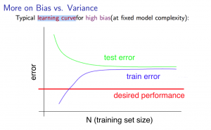

# Advice for Applying Machine Learning

## Evaluating a Learning Algorithm

### Evaluating a Hypothesis

Once we have done some trouble shooting for errors in our predictions by:

- Getting more training examples
- Trying smaller sets of features
- Trying additional features
- Trying polynomial features
- Increasing or decreasing $\lambda$

We can move on to evaluate our new hypothesis.

A hypothesis may have a low error for the training examples but still be inaccurate (because of overfitting). Thus, to evaluate a hypothesis, given a dataset of training examples, we can split up the data into two sets: a **training set** and a **test set**. Typically 7:3

The new procedure using these two sets is then:

1. Learn $\Theta$ and minimize $J_{train}(\Theta)$ using the training set
2. Compute the test set error $J_{test}(\Theta)$

#### The test set error

1. For linear regression: $J_{test}(\Theta) = \dfrac{1}{2m_{test}} \sum_{i=1}^{m_{test}}(h_\Theta(x^{(i)}_{test}) - y^{(i)}_{test})^2$

2. For classification ~ Misclassification error (aka 0/1 misclassification error):
   $$
   err(h_\Theta(x),y) =
   \begin{cases} 1 & \mbox{if } h_\Theta(x) \geq 0.5\ and\ y = 0\ or\ h_\Theta(x) < 0.5\ and\ y = 1\newline 0 & \mbox otherwise 
   \end{cases}
   $$

This gives us a binary 0 or 1 error result based on a misclassification. The average test error for the test set is:

$$
\text{Test Error} = \dfrac{1}{m_{test}} \sum^{m_{test}}_{i=1} err(h_\Theta(x^{(i)}_{test}), y^{(i)}_{test})
$$
This gives us the proportion of the test data that was misclassified.

### Model Selection and Train/Validation/Test Sets

Just because a learning algorithm fits a training set well, that does not mean it is a good hypothesis. It could over fit and as a result your predictions on the test set would be poor. The error of your hypothesis as measured on the data set with which you trained the parameters will be lower than the error on any other data set.

Given many models with different polynomial degrees, we can use a systematic approach to identify the 'best' function. In order to choose the model of your hypothesis, you can test each degree of polynomial and look at the error result.

One way to break down our dataset into the three sets is:

- Training set: 60%
- Cross validation set: 20%
- Test set: 20%

We can now calculate three separate error values for the three different sets using the following method:

1. Optimize the parameters in $\Theta$ using the training set for each polynomial degree.
2. Find the polynomial degree $d$ with the least error using the cross validation set.
3. Estimate the generalization error using the test set with $J_{test}(\Theta^{(d)})$ (d = theta from polynomial with lower error);

This way, the degree of the polynomial d has not been trained using the test set.

## Bias vs. Variance

### Diagnosing Bias vs. Variance

In this section we examine the relationship between the degree of the polynomial $d$ and the underfitting or overfitting of our hypothesis.

- We need to distinguish whether **bias** or **variance** is the problem contributing to bad predictions.
- High bias is underfitting and high variance is overfitting. Ideally, we need to find a golden mean between these two.

The training error will tend to **decrease** as we increase the degree $d$ of the polynomial.

At the same time, the cross validation error will tend to **decrease** as we increase $d$ up to a point, and then it will **increase** as $d$ is increased, forming a convex curve.

**High bias (underfitting)**: both $J_{train}(\Theta)$ and $J_{CV}(\Theta)$ will be high. Also, $J_{CV}(\Theta) \approx J_{train}(\Theta)$.

**High variance (overfitting)**: $J_{train}(\Theta)$ will be low and $J_{CV}(\Theta)$ will be much greater than $J_{train}(\Theta)$.

The is summarized in the figure below:

### Regularization and Bias/Variance

In the figure above, we see that as $\lambda$ increases, our fit becomes more rigid. On the other hand, as $\lambda$ approaches 0, we tend to over overfit the data. So how do we choose our parameter $\lambda $to get it 'just right' ? In order to choose the model and the regularization term $\lambda$, we need to:

1. Create a list of lambdas (i.e. $\lambda \in \{0,0.01,0.02,0.04,0.08,0.16,0.32,0.64,1.28,2.56,5.12,10.24\}$);
2. Create a set of models with different degrees or any other variants.
3. Iterate through the $\lambda$s and for each $\lambda$ go through all the models to learn some $\Theta$.
4. Compute the cross validation error using the learned $\Theta$ (computed with $\lambda$) on the $J_{CV}(\Theta)$ **without** regularization or $\lambda$ = 0.
5. Select the best combo that produces the lowest error on the cross validation set.
6. Using the best combo $\Theta$ and $\lambda$, apply it on $J_{test}(\Theta)$ to see if it has a good generalization of the problem.

### Learning Curves

Training an algorithm on a very few number of data points (such as 1, 2 or 3) will easily have 0 errors because we can always find a quadratic curve that touches exactly those number of points. Hence:

- As the training set gets larger, the error for a quadratic function increases.
- The error value will plateau out after a certain m, or training set size.

**Experiencing high bias:**

- **Low training set size**: causes $J_{train}(\Theta)$ to be low and $J_{CV}(\Theta)$ to be high.

- **Large training set size**: causes both $J_{train}(\Theta)$ and $J_{CV}(\Theta)$ to be high with $J_{CV}(\Theta) \approx J_{train}(\Theta)$.

If a learning algorithm is suffering from **high bias**, getting more training data will not **(by itself) **help much.

**Experiencing high variance:**

- **Low training set size**: $J_{train}(\Theta)$ will be low and $J_{CV}(\Theta)$ will be high.

- **Large training set size**: $J_{train}(\Theta)$ increases with training set size and $J_{CV}(\Theta)$ continues to decrease without leveling off. Also, $J_{CV}(\Theta) \gt J_{train}(\Theta)$ but the difference between them remains significant.

If a learning algorithm is suffering from **high variance**, getting more training data is likely to help.

### Deciding What to Do Next Revisited

Our decision process can be broken down as follows:

- **Getting more training examples:** Fixes high variance

- **Trying smaller sets of features:** Fixes high variance

- **Adding features:** Fixes high bias

- **Adding polynomial features:** Fixes high bias

- **Decreasing λ:** Fixes high bias

- **Increasing λ:** Fixes high variance.

#### **Diagnosing Neural Networks**

- A neural network with fewer parameters is **prone to underfitting**. It is also **computationally cheaper**.
- A large neural network with more parameters is **prone to overfitting**. It is also **computationally expensive**. In this case you can use regularization (increase $\lambda$) to address the overfitting.

Using a single hidden layer is a good starting default. You can train your neural network on a number of hidden layers using your cross validation set. You can then select the one that performs best.

**Model Complexity Effects:**

- Lower-order polynomials (low model complexity) have high bias and low variance. In this case, the model fits poorly consistently.
- Higher-order polynomials (high model complexity) fit the training data extremely well and the test data extremely poorly. These have low bias on the training data, but very high variance.
- In reality, we would want to choose a model somewhere in between, that can generalize well but also fits the data reasonably well.

# Machine Learning System Design

## Building a Spam Classifier

### Prioritizing What to Work On

> **System Design Example:**
>
> Given a data set of emails, we could construct a vector for each email. Each entry in this vector represents a word. The vector normally contains 10,000 to 50,000 entries gathered by finding the most frequently used words in our data set. If a word is to be found in the email, we would assign its respective entry a 1, else if it is not found, that entry would be a 0. Once we have all our x vectors ready, we train our algorithm and finally, we could use it to classify if an email is a spam or not.
>
> 

So how could you spend your time to improve the accuracy of this classifier?

- Collect lots of data (for example "honeypot" project but doesn't always work)
- Develop sophisticated features (for example: using email header data in spam emails)
- Develop algorithms to process your input in different ways (recognizing misspellings in spam).

It is difficult to tell which of the options will be most helpful.

### Error Analysis

The recommended approach to solving machine learning problems is to:

- Start with a simple algorithm, implement it quickly, and test it early on your cross validation data.
- Plot learning curves to decide if more data, more features, etc. are likely to help.
- Manually examine the errors on examples in the cross validation set and try to spot a trend where most of the errors were made.

> For example, assume that we have 500 emails and our algorithm misclassifies a 100 of them. We could manually analyze the 100 emails and categorize them based on what type of emails they are. We could then try to come up with new cues and features that would help us classify these 100 emails correctly. Hence, if most of our misclassified emails are those which try to steal passwords, then we could find some features that are particular to those emails and add them to our model. We could also see how classifying each word according to its root changes our error rate:
>
> 

It is very important to get error results as a single, numerical value. Otherwise it is difficult to assess your algorithm's performance. 

> For example if we use stemming, which is the process of treating the same word with different forms (fail/failing/failed) as one word (fail), and get a 3% error rate instead of 5%, then we should definitely add it to our model. However, if we try to distinguish between upper case and lower case letters and end up getting a 3.2% error rate instead of 3%, then we should avoid using this new feature. Hence, we should try new things, get a numerical value for our error rate, and based on our result decide whether we want to keep the new feature or not.

## Handling Skewed Data

skewed classes: having a lot more of examples from one class than from the other class.

> Example: Cancer classification
>
> Train logistic regression model and find that you got 1% error on test set.
>
> Say there is only 0.5% of patients have cancer, predicting y = 0 all the time can also get 0.5% error, using error rate seems unreasonable here.

accuracy and error rate are no longer useful error metric in skewed classes, instead we using **Precision** and **Recall**

$y=1$ in presence of rare class that we want to detect.

precision and recall are defined as:

$$
\text{Precision} = \frac{\text{True positives}}{\text{# predicted as positive}} = \frac{\text{True positives}}{\text{True positives + False positives}}
$$

$$
\text{Recall} = \frac{\text{True positives}}{\text{# actual positives}} = \frac{\text{True positives}}{\text{True positives + False negatives}}
$$

### Trading Off Precision and Recall

logistic regression: $0 \leq h_{\theta}(x) \leq 1$

- $\text{predict} \ y=1 \ \text{if} \ h_\theta(x) \geq \text{threshold}$
- $\text{predict} \ y=0 \ \text{if} \ h_\theta(x) \lt \text{threshold}$

predict $y=1$ only if very confident.

- higher threshold
- higher precision
- lower recall

avoid false negative (e.g. avoid missing too many cases of cancer)

- lower threshold
- lower precision
- higher recall

Precision-Recall curve, visualize trade-off

compare precision and recall numbers: **F1 score** (F score)
$$
2 \frac{PR}{P+R}
$$

## Using Large Data Sets

### Data For Machine Learning

under certain conditions, getting a lot of data and training on a certain type of  learning algorithm, can be a very effective way to get a learning algorithm to do very good performance.

#### Large data rationale

Assume feature $x \in \mathbb R^{n+1}$ has sufficient information to predict $y$ accurately.

> useful test: Given the input $x$, can a human expert confidently predict $y$ ?

Use a learning algorithm with many parameters (e.g. logistic regression/linear regression with many features; neural network with many hidden units)

Use a very large training set (unlikely to overfit)